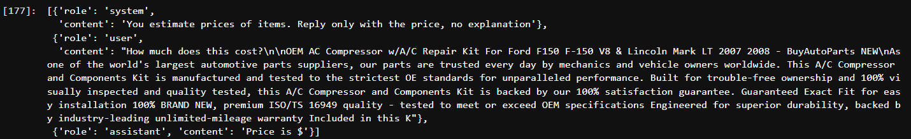
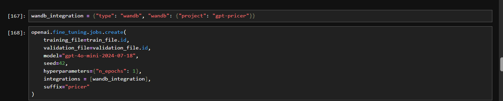
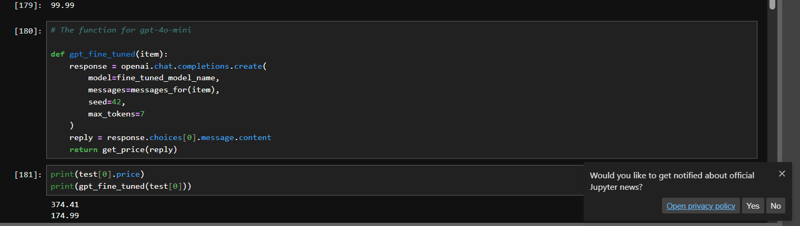

## Traditional ML Models

- Training the dataset with traditional ML often gives you poor result.

## Prompting

- Here we can use frontier model to predict the data, we are not training the frontier model.we are giving the test data to predict the result.
- we need to structure the prompt using System message, user message and the assistant.
- And pass the message to the frontier models like gpt,claude.This gives us better result

## Finetuning the frontier model

- we can finetuning using openai model, we are going to finetune the openai model with 200 training data.
- Prepare our data for fine-tuning in JSONL (JSON Lines) format and upload to OpenAI.For this convert the prompt message as json objects and write into a file.

    

- Now we need to use openai.fine_tuning.jobs.create(), this function accepts training file,validation file and choose the model and make sure to give the hyperparameter.

    

- Now we need to call openai.chat.completions.create(), now in the model parameter,pass the model you trained and check the result..

    