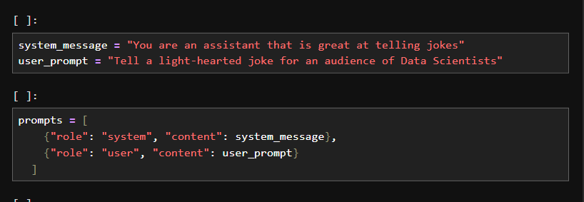
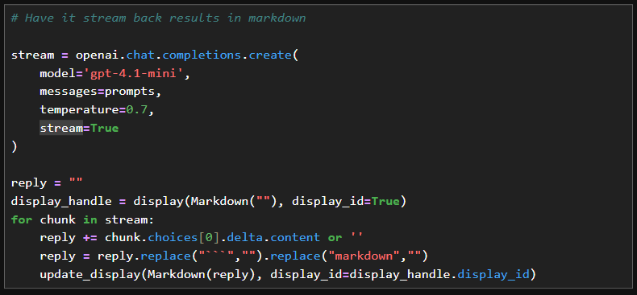
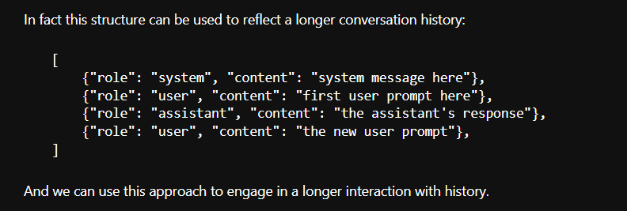
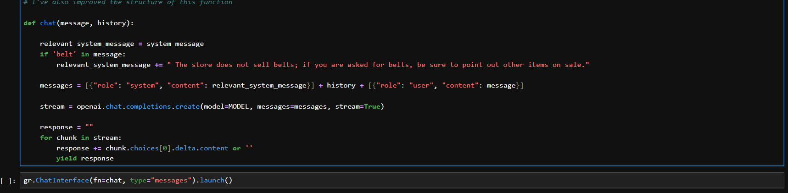
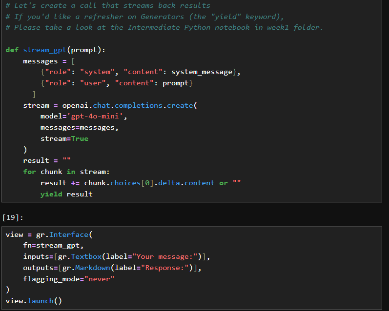
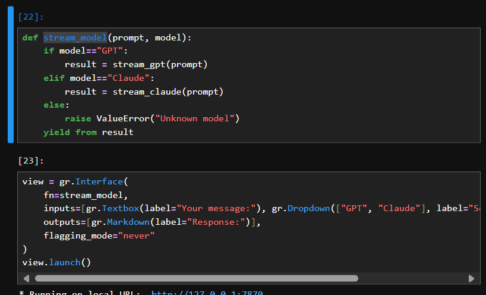
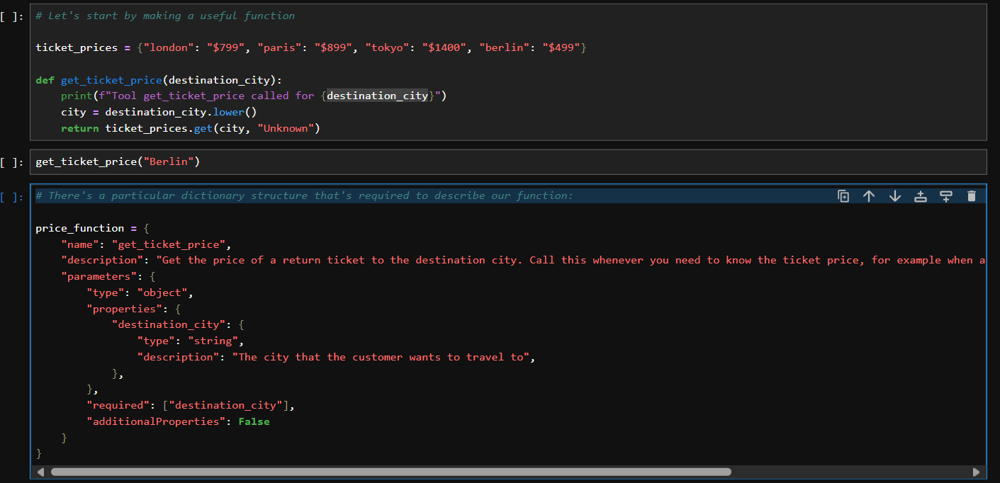
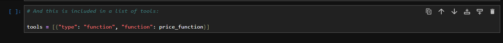
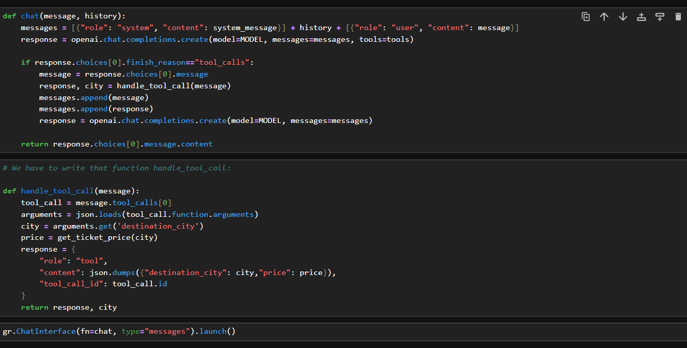

## Frontier Models

- There are different types of models like openAI, Claude, Phi3, gemma and ollama.

## 1. How to setup these API

- Create an API key in the respective model example like openai api key or claude api key..
- Then we need to define the system message and user message
- And construct these message as role and contents..

    

- Then we need to use if it is for openai..we need to use function called openai.chat.completion.create() and the parameters for this functions are we need to define the model whether it is gpt4 or gpt5 and we need to pass the messages we constructed previosuly...
- The other parameter is like we can set the temperature and we can stream this alsoo..while streaming make sure to use the markdown for the text font and stlye..

    

- we can define the max token..
- Likewise the same method we can use it for different models like openai, claude, gemma, phi3 and deepseek..

## 2. we can use multimodel

- we can have system message..after user message and the assistant the same we can do
- we need to use function called chat() it excepts 2 parameters one is history and another is what's the current message..

    

- we can set the system message and history and we need to construct and the relevant messages..we can pass this to our openai api..

    

## 3. Gradio UI.

- Using Gradio we can build UI faster and integrate with python quickly..
- first we can construct function that call the openai to get the response and we can stream it..
- and we can build simple UI using gradio to enter the message and get the response back to the UI.

    

- If you want to include multiple models in the UI, we can construct that also..

    

## 4. Airline AI Assistant

- we need to define the openai api key..
- we need to construct the system message and we need to call chat() it accepts 2 parameters message, history..
- construct messages with system message, history and user message and pass it to the open ai..
- Here tools are incredibly powerful features in the frontier models..we need to write function for our tool.
- construct a function and There's a particular dictionary structure that's required to describe our function.

    

    

    