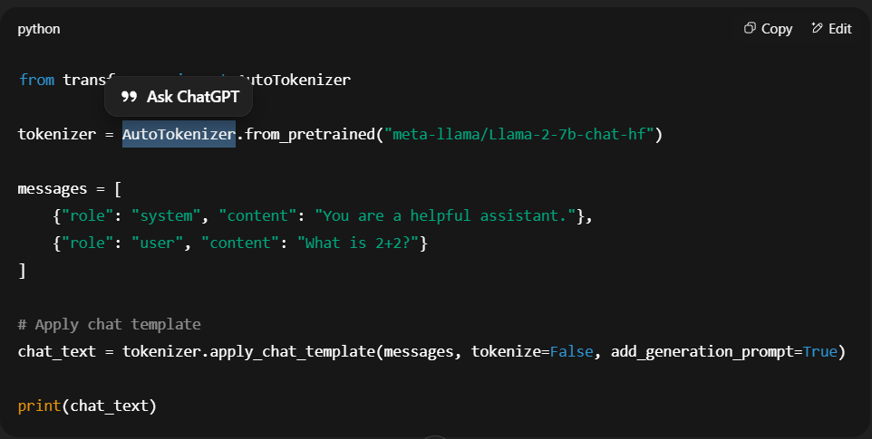
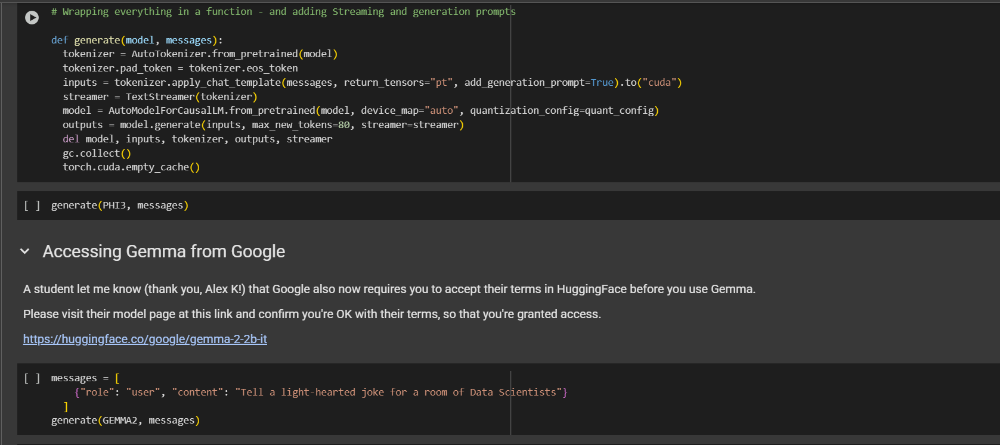

## Hugging Face

It's a opensource library,Offers you three things,

- Models : All the models available for you
- Datasets: ready to use datasets for ML.
- Spaces: deploy ML Models using gradio

HuggingFace offers you Libraries

- Hub - a place where developer shares the model
- Datasets Libraries
- Transformers - All the LLM Models available for you from gpt to bert...
- peft(parameters efficient fine tuning) - advanced librariess..
- trl(transformer) - supervisor fine tuning
- Accelerate 

- It provides you the inference endpoint, we can run the hugging face model without worrying abt the infrastructure..

## Two API levels of hugging face

- Pipelines
- Tokenizers and models

##  High Level API

## 1. Pipelines 

- High level api to run the comman tasks...
- Sentimental analysis, Classifier(ML Task), Named Entity Recognition(will tell its a Person or animal or others), Question Answering, Summarizing, Translation, text-generation,audio generation
- use pipelines to generate content like text, Image and audio..

- for sentimental analysis

    classifier = pipeline("sentiment-analysis")
    result = classifier("I'm super excited to be on the way to LLM mastery!")
    print(result)

example : 

    var = pipeline(what action...)
    result = pipeline(what action we need to perform or the input)
    print(result)

## Low Level API 

## 1. Tokenizer

- we can tokenize the sentence
- we need to use Autotokenizer.from_pretrained() we need to initialize the model as a parameter
- Token.encode() : text to token
- token.decode() : token to text

- for different tokenizer like gpt,lamma,phi3 the special tokens will be different..
- we need to use applychattemplate() to add special tokens in the sentence..for each model we have different different special token

    

## 2. Models

- different types of models like gpt,lamma,phi3,gemma..we can choose anyone of this
- we need to set system message and user message.
- we need to set quantization, because it is used to reduce to weight of the model, so it is easy to fit in the memory..
- now we need to use AutoTokenizer.from_pretrained() to load the tokenizer model and tokenize the sentence
- add padding and apply chat template() so that it will add special tokens..
- Then we can use AutoModelForCausalLM.from_pretrained() to use hugging face open source LLM, we can use quantization so that it reduce the weight of the model..this will implement the transformer architecture..
- Then use model.generate() pass the input to predict the next word..

    