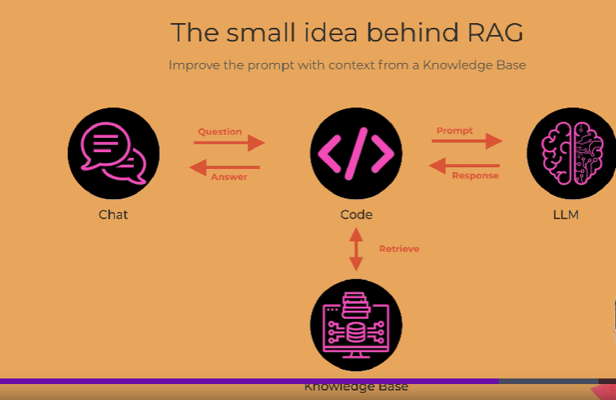
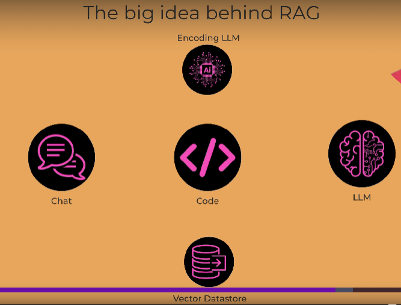
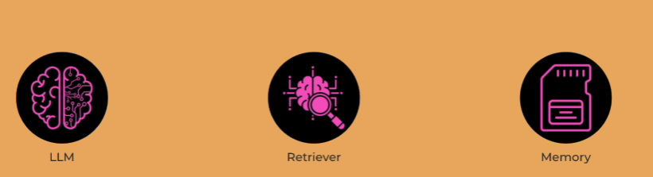

## RAG (Retrieve Augmented Generation)

- In RAG, In the chat user first ask the question and in the code before we sending it to LLM we can check in the knowledge base whether we can have any relevant information.
- After that only we send it to the LLM and LLM responds..

    

## Building the RAG

- If you are working on usecase which is Insurance tech company, we need to have knowlwdge base as a folder inisde it we can have different folders like company(carrers,about,overview), contracts(companies contracts), Employees(HR Details) and products(Product details).all this are company data. 
- we are going to use python function called glob.glob() - this will look for the files in the particular folder and initalize it to the variables..
- we are going to iterate the files and open the file one by one and put it in the dictionary..
- construct the dictionary look for the message in the dictionary..
- construct the system, user, assistant to expect as gpt model and work

## Diff bt Auto-regressive and Auto-Encoding

- Auto-regressive LLM predicts the future token from the past input.
- Auto-encoding LLM produce the output based on the full input..e.g sentimental analysis.

## Vector Embedding

- will convert the text to series of numbers that represent the meaning behind the text..
- in the graph for eg..all the tokens are in near by direction which means they have similar meaning..the tokens have similar meaning..things close to each in vector space have same meaning..

    

- Now along with the text, we need to store the meaning of the text.
- we got the question and using encoding LLM we can turn that in to the vector.
- suppose if the question who is Amy Lancester ?, so we take the question turns into a vector that reflects the meaning of the question.
- Then once we vectorize it, we go to the vector database and we say tell me what information is in the vector database whether the vectors are close to the vector for who is Amy Lanacester.
- we shove that in the prompt to the LLM to get back the result

## LangChain

- Build LLM Applications quicklyy..
- It has his own language LCEL(LangChain Expression Language).
- read the document using langchain loaders
- using langchain we can use directoryLoader, textloaders to load the directory and text.
- we can use characterTextsplitter to split the characters.

## Vector Embedding Models

- word2vec: words to vector
- BERT
- Open AI Embedding

## Embedding and Chroma

- do the imports in langchain.
- we will be mapping each text in the chunk into vector known as embedding..
- OpenAi offers the openAIEmbedding()
- Chroma to store the vector

## RAG Pipeline

- Define a new chat with openAI using chatopenai()
- we need to use conversationBufferMemory() in langchain to use as memory.
- use retriver() we can define the retrieve the data from vector store.
- we can use function called conversationalRetrievalChain.from_llm()we can pass the llm, retriever and memory..

    