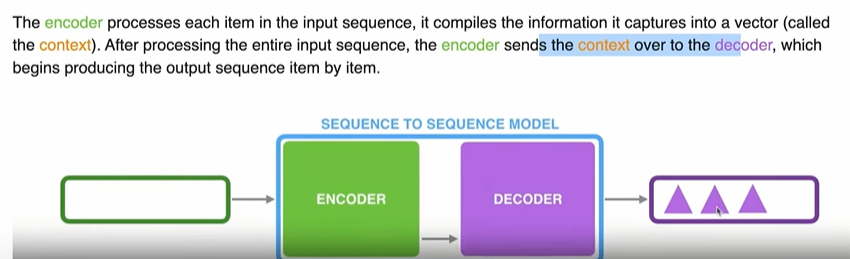
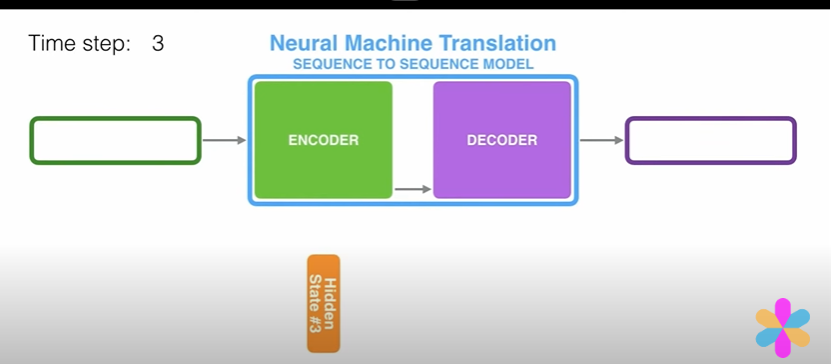
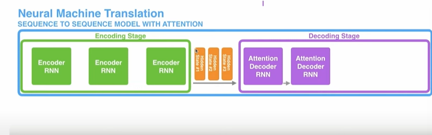
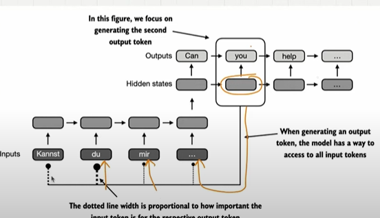

## Attention Mechanism

- Long term sentence is a difficult for LLM to understand,
- Few words LLM needs to pay understand.
- Attention mechanism needs to be there to understand the priority of the words.

## 1. 4 Types of Attention Mechanism

- Simplified self attention,
- Self Attention,
- Causual Attention,
- Multi-head Attention.

## 2. History of Attention Mechanism

- Before Attention mechanism, word by word translation does not work.
- Undertand the context and grammar aligment before developing model.
- we need memory to understand what happend..
- Encoder and Decoder
- Encoder will receive the input and after processing the entire sequecene the encoder sends the context over to the decoder and decoder generate and gives the output sequence.
    
    

- Before transformer, RNN were the most popular for encoder decoder architecture.
- Encoder will receive input one at a time or word by word.
- For each input encoder will create a hidden state, this hidden state contains the context or the memory of the previous word.
- And when the input arrives, we have a final hidden state and that will fed up tp the decoder.
- decoder then produce the output from the final hidden layer one at a time.

    

## 3. Why do we need Attention  

- Decoder will only have access to final hidden state, it will not have any access to previous hidden state.
- when we have a long sequence of text, since we are sending final hidden layer to the decoder..Lot of pressure on the decoder to give the output from the final hidden layer.It usually fail for long sequence.
- RNN can't directly access the earler hidden state during the decoding..it relay on final hidden layer 
- It leads to loss of context for long sequcene.
- RNN can't captures all the information in the final hidden state.
- RNN must remember the entire encoded text in a single hidden state before passing it to the decoder.this is one of the shortcoming.

## 4. Traditional Attention Mechanism.

- In the same encoder-decoder architecture
- using attention mechanism, Decoder can selectively access the different input sequence at each decoding step.
- While decoding "you", decoder will have an access to all the hidden layers created by the encoder.
- we can decide how much attention to give to the each of the words in the encoder.we have something called attention weights using this we can give the attention.
- this saves the loss of context in RNN.
- Dynamic focus on all the input sequence..
- Encoder will create an input hidden state for each sequecnce and sends this hidden layer to the decoder.
- Decoder will have access to all these input hidden layer.
- It's not mindless align the  words,It's actually learned from the training phase, which word to align..which word..

    

    

- Researches found out RNN Architecture are not required for NLP, so they proposed transformer architecture.Important is Attention Mechanism.

## Self Attention 

- we are looking at an one input sequence, we learns the relationship between these various part of the input itself.how they are related with each other.