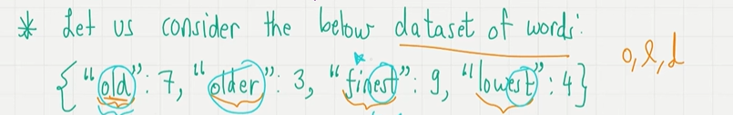
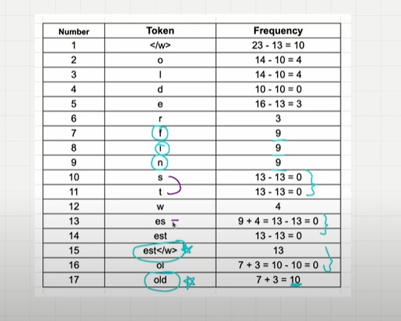
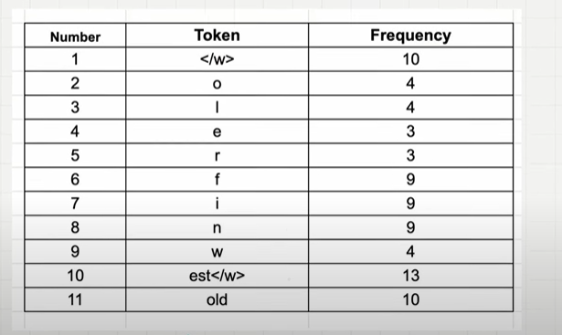
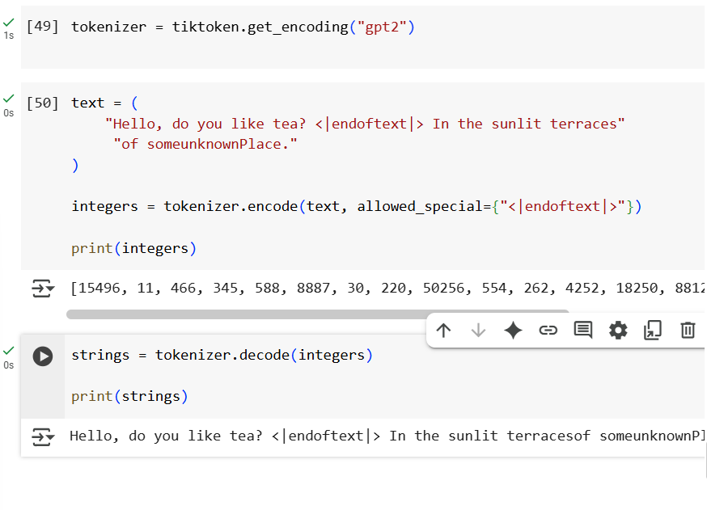

## Tokenization Algorithm

- Word based algorithm,
- Character based algorithm,
- Subword based algorithm.

## 1. Word Based Algorithm

- Breaks the senctence into word is called as tokens.
- **Problem 1:** If the words are not there it will throw **out of vocabulary(OOV)** words.we need to include all the words present in the english language.It's 1 millions words.
- **Problem 2:** Different meaning of similar words(boy, boys)..each word has a token and token Ids.Hard to capture the similiarity between these words.

## 2. Character Based Algorithm

- Splits each text into each character and assign a token for each unique character.
- Very small vocabulary, we only have fixed number of characters[english vocabulary = 256 characters].
- **Fixing :**Solve the Out of vocabulary(oov) problem.
- The meaning associated with the word is completely lost.Tokenized sequence is much longer than the initial raw text.
**E.g :** dinosaur - 8 tokens..In word based tokenization dinosaur will be considered as a 1 token but here its 8 tokens,it's tokenizarion is big.

## 3. Sub-word based Tokenization[Byte Pair Encoding]

- **Rule 1:** Do not split frequently used words into smaller subwords.
- **Rule 2:** Split the rare words into smaller, meaningful into subwords.

**E.g** 
- "Boy" may occur many times,so should not be split.
- "Boys" should be split into "boy" and "s".

The subword splitting helps the model learn the different words with the same root word as "boy" like "boys"

## 4. Byte Pair Encoding is a Subword Tokenization Algorithm.

- Look for the consectuive common pair of character in a text and replace with a single character which is not present.Till all the character will be single digit.

**Orginal Data:** aaabdaaabac

- The byte pair 'aa' occurs the most, we will replace it with Z.with Z does not occur in the data..
- **Compressed Data:** ZabdZabac.

- The next common pair is 'ab'.we will replace it with y.
- **Compressed Data:** zydzyac.

- The next common pair is 'zy'. we will replacw it with w.
- **Compressed Data :** wdwac

- Everything appear only once.so we don't encode..

## 5. BPE Algorithm used for LLM.

- BPE Ensures most common words in the vocabulary considered as a single token.
- While rare words are broken down into two or more subword tokens.
- for frequent pairing, merge them and perform the same iteration again and agian until we reach the token limit.
- First all the words are splitted into individual charaters.
- we look for the common pairing and merge them, most common pair is "es",merge them create a new token.
- In the next Iteration everything other common byte pair follows.
- The below list of 11 tokens will serve as a vocabulary.Here we have characters as well as subwords
- The Stopping criteria can either be token count or the number of iterations.

    
    
    

## 6. BPE Code for LLM

- We can use tiktoken python library and to use it for Encoding and decoding.
- This is the BPE is used in Open AI's models.
- Encoder will expect the input as a text and gives token Ids as an ouput 
- where as decoder will expect token Id as an input and gives text as output.
- Import the library and we can initialize the tokenizer, we can use gpt2 tokenizer.
- It automatically handles the unknown words and not throw any error or not mentioning the unkown to the user.
- Vocabulary size is not too big
- Retains the meaning of the root words.
- Vocabulary size for gpt2 is around 50,000 for bpe.

