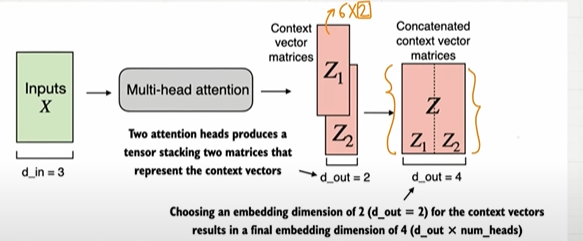
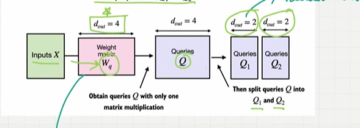
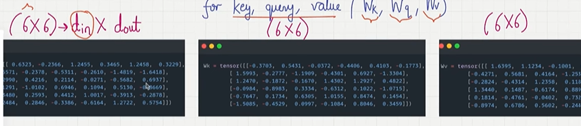
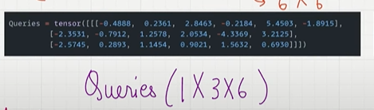
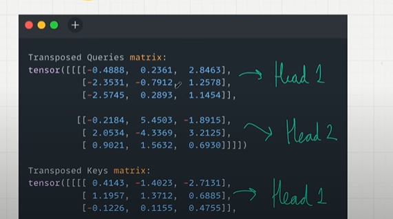
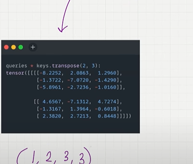
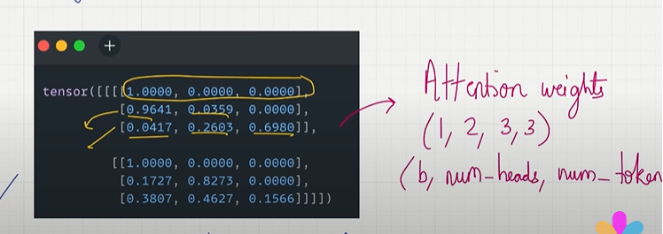

## Multi Head Attention Mechanism

- Running causal self attentions multiple times..
- Dividing the attention mechanism into multiple heads
- Each heads operating independently
- create mltiple instance of self-attention mechanism each withs its own weights and then combaining their output..
- This makes LLM Performs much better.

    

- We have a input vector embedding for a words.
- Now we need to have trainable weight matrices for each queries(Wq1,Wq2), keys(Wk1, Wk2) and values(Wv1,Wv2).
- Now calculate the query,key and value by multiplying wq1*input,wq2*input, and so on..
- Now we have query1,query2,key1,key2,value1,value2 and so on.
- calculate the attention score separately for each queries,keys by multiplying it.
- calculate the attention weight.
- And now finally for each attention weights, multiply it with respective values to the context vector..
- Now we have 2 context vector and concat the 2 context vector.

    

## Coding Multi head Attention

- If the number of head is 5, we can create 5 instance of causual attention class and we concat it together.

    

## Multi-Head Attention with Weights splits

- let say we need 96 traiable weights for queries and key, so multiplying 96 times to get the attention score is not efficient.
- Make sure number of multiplication is reduced..
- Basically previously we calculated the context vector for every head individul time, we concated the context vector.
- first we need to trainable weight matrix with higher dimensions dout = Head dimension*num of heads = 2*2=4.
- Then multiply input with trainable weights to get the query with higher dimensions.
- Then split the matrix based on the num of head which is 2.

    

## Coding of Multi-Head Attention Layer

- **Step 1:** Start with the input b[ batch = 1 ], num_tokens[num of words = "The cat sleep"],d_in[Vector Dimensions] = (1,3,6).

- **Step 2:** Decide d_out and num_Heads.Context Vector will be input_token * d_out which is 3 * d_out.D_in and D_out will be same.Like we need to deicde how many attentions head also we need as now num_head=2.Each head will have dimension which is head_dim.head_dim = d_out/Num_Head = 6/2=3.Each head will have 3 dimensions.

- **Step 3:** Intialize the trainable weights for key,query and value which is wq,wk and wv.
 = d_in * d_out = (6 X 6).Each trainable weight matrix have 6 x 6 dimension.
 we use linear layer to optimize the weight.
    

- **Step 4:** Calculate Keys, Queries and Value Matrix
(Input * wq, Input * wk, Input * wv)
Input dimensions : (1 X 3 X 6),
Wq               : 6(d_in) X 6(d_out)

When you multiply the matrices the result you get is : (1 X 3 X 6) which is (b, num_tokens, d_out)

Multiply everything with input dimensions which is wq,wk and wv.

- **Step 5:** we need to introduce 4the dimension to set the dimension of head or head_dimension. unroll the dimensions of key,queries and values to include num_heads and head_dim.

head_dim = d_out/num_heads = 6/2 = 3.

(1,3,6) which is (b,num_token,d_out) -----> (b,num_tokens,num_heads,head_dim) which is (1,3,2,3) d_out we will be replaces with num_head and head_dim.

How to interpret this 4 dimensions which is (1,3,2,3):
1 - batch,
3 - Number of rows it's a token.
2 - For each token we have a head,first row correspond to the first head and second row correspond to the 2nd head.
3 - within each head i have 3 dimensions

it's like 3 tokens, inside 3 tokens we have 2 head each..inside a batch we have 3 dimesions.

- Every token has 2 attention head head 1 and head 2 like 2 people paying attention to each token.

The all the matrix key, value and query all have (1,3,2,3) matrixes..

This splitting is then achieved using the .view method: a tensor of dimensions (b, num_tokens, d_out) is reshaped to dimension (b, num_tokens, num_heads, head_dim).

- **Step 6:** 
Take this (1,3,2,3)
- Now your query matrix is grouped into num of tokens right.
- For calculating the attention score the only way to do computation will proceed ahead like we need to grouping by number of heads.
- To do that, we need to flip the num_of_token(1) to num_head(2) and finally it will be like (1,2,3,3).
- (1,3,2,3) - (1,2,3,3)
- The tensors are then transposed to bring the num_heads dimension before the num_tokens dimension, resulting in a shape of (b, num_heads, num_tokens, head_dim).
- This transposition is crucial for correctly aligning the queries, keys, and values across the different heads and performing batched matrix multiplications efficiently.

    

- Now everything will be grouped based on the head in all the queries,keys and value.
- we can compute the attention score for each head.

- **Step 7:** Find attention score

-  Queries * keys.Transpose(2,3)
- we can do transpose so it will be helpful in the matrix multiplication to multiply queries head1 only multiply with keys head1 and queries head2 only multiply with key2 head2
- if we do transpose the row will be changed as column
- Once you multiply u will get an attention score..

    

- dimensions will be : (num_token,head_dime) X (head_dim,num_tokens)
- Dimenions are (b, num_heads, num_tokens, num_tokens)

- **Step 8:** Find Attention Weights

- Mask the future words in attention score using causual attention..
- replace the diagonal above with negative infinity.
- Divide every single element by square root of head dimeneions..sqr(head_dim = d_out/num_head) = sqrt(3)..we divide the sqrt of 3.
- Apply softmax to sums upto 1.dim=-1 makes sure everything sums upto 1.

    

- Dimensions also (1,2,3,3) which is (b,num_head,num_tokens,num_tokens)

- Add dropout to turn off some neurons..

- **Step 9:**  calcaluate context vector

- Context Vector : Attention_weights * values
Attention weights : (b,num_heads,num_token,num_tokend) which is (1,2,3,3)
values : (b,num_heads,num_tokes,head_dim) which is (1,2,3,3)
- we need to merge the num_heads and head_dim vector together.
- resultant : [ 3 X d_out] to achieve this
- swap num_heads and num_token in values, 
- reformat the value (b,num_tokens,num_head,head_dim) which is (1,3,2,3).now num_heads and head_dim are closer...

- flatten and combine the output, first row consisit of merging of 2 heads..
- final resul(,num_tokens,d_ot)