## GPT Architecture

- Token Embedding
- Position Embedding
- Dropout
- Transformer Blcok
- Normalization
- Final ouputs.

    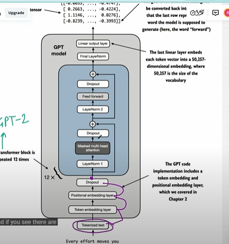

    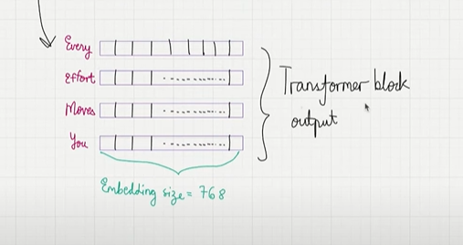

## Word : Every effort moves you

- We can take every word map to token Id.
- Let say we have 2 batches, which means 2 sentence..But for the simplicity purpose we can take one batch and use it here.
- And also we can use byte pair encoder sub-word based tokenizer..we can use..
- tiktoken is used to encode and decode..

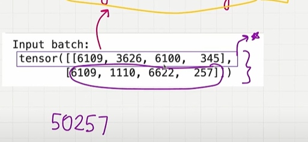

## 1. Token Embedding 

- Take this token id convert this into token embedding vectors..
- we need to capture the semantic meaning of the word.
- if we represent the words into vectorial format we can capture the semantic meaning of the words.
- Convert every token into token embedding vector.
- To decide an embedding size, we are using embedding size of 768 this was used in smallest gpt model..
- if you take first token "Every" it is encoded into 768 dimensions vector.
- if you take second token "Effort" it is encoded into 768 dimensions vector and so on all the tokens..
- Let say cat and kitten, Initially we are randomly setting  the direction in the 768 dimensionals space.but when the model is trained or when the embedding vector is trained they will be closer or they will be aligned..
- embedding size = 768.
- context size is 4, context size is like number of maximum words to use which can used be predicted to the next word.. 

## 2. Positional Embedding

- we need to also capture where the word comes into the particular sentence...like every comes in the first position, comes in the second and so on...
- we also repressting every position in the embedding vector..
- position 1 to 4...which is based on the context length..postion num 1 and 2 everything has 768 dimensional vectors..
- similar to token embedding we don't know the value of each of the positonal embedding vector..these are intialized randomly..but these will be trained in the training procedure..
- embedding size = 768.

## 3. Input Embedding = Token Embedding + Positional Embedding.

- for the first word which is every we are going to take the token embedding and add it the positional embedding and the result is input embedding which embedding dimensions  size as 768.
- Then for the second word which is effort we are going to take the token embedding(2) and add it the positional embedding(2) and the result is input embedding which embedding dimensions  size as 768.
- embedding size = 768.
    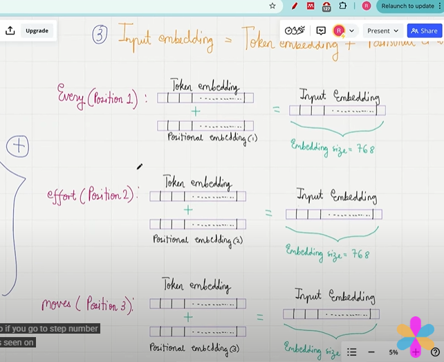

## 4. Dropout

- we have input embedding for every words and we have input embedding dimesions of 768.
- we randomly turn off every input embedding value to zero and that specified by dropout rate.
- If the dropout rate is 50%, every embedding randonly 50% of the element is turned off to zero.
- 50% of 764 is 384 right,384 element in each input embedding will be turned off to zero this done for every token..Average of 50 % will be turned off..
- why dropout implement prevent overfitting, implement trining will be effective..
- it will turn off the lazy neurons but the neurons have no choice but to learn something..that improve generalization performance.because every neurons try to learn something..
- embedding size = 768.

    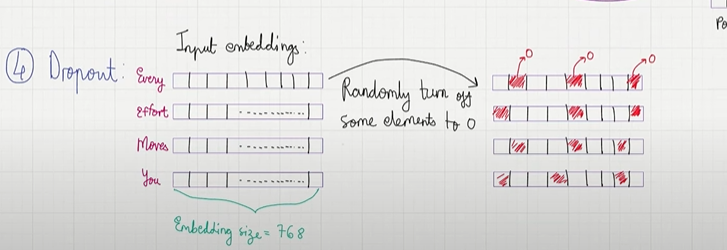

## 5. Transformer

## Step 5.1 : Layer Normalization

- It looks at the every token and its value and it will normalize the value so that after the normalization the mean will be 0 and variance will be 1.
- this will be done for every single tokenn.
- Normalization is performed to improve the stability during the training procedure..
- embedding size = 768.
    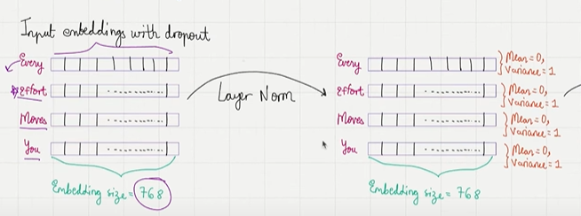

## Step 5.2 : Multi-Head Attention

- Masked multi Head attention.
- so here we take the embedding vectors and we can convert them into context vector..
- Along with capturing the semantic meaning of "Every" which the vector embedding already did. this context vector also capture the information about how much attention we need to give to the all the other words in the sentence.
- This will also tell which words to tell what is the meaning bt different words and how do different words attend each other...
- embedding size = 768.

    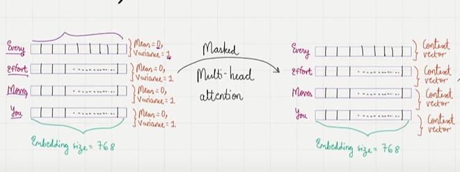

## Step 5.3 : Dropout

- Randomly turns off certain context vector values to zero..
- embedding size = 768.

    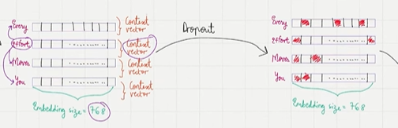

## Step 5.4 : Shortcut Connection

- Add an alternative path
- Take the output of one layer attach it to the output to another layer..
- prevent vanishing gradient problem..which means training proceeds in much smoother manner
-  embedding size = 768.

    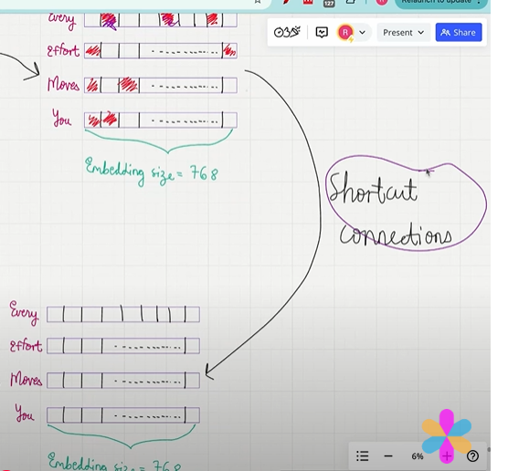

## Step 5.5 : Layer Normalization

- Normalize the embedding layer..again look for every row and apply normalization..check mean is 0 and varaince is 1.
- embedding size = 768.

    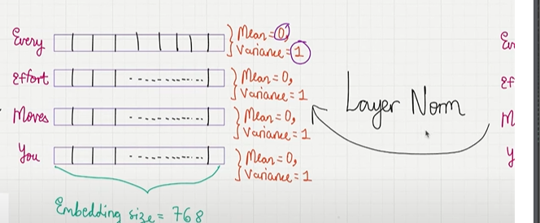

## Step 5.6 : Feed Forward Neural Network

- It's like of expanison and contradiction network, ley say u have the inputs..we process every input step by stepp..
- look at the token every its 768 dimensional token right
- we projected them into higher dimesions..
- num of neurons in the hidden layer is 4 times 768.which is 4 times embedding dimensionss.that allows us much richer explanation of parameter..that makes the llm much better at predictions of the next word..
- then we contract back to the orginial dimesions as ouput
- output same as input...
- embedding size = 768.

    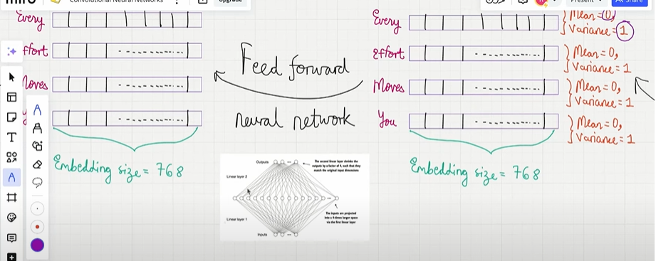

##  Step 5.7 : Dropout

- After that we have another dropout layer which randomly turn off the certain values equal to be zeroo..
- embedding size = 768.

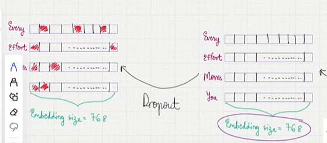

## Step 5. 8 : Shortcut Connection

- Attaching output of one layer to another layer..

## Step 5.9 : Transformer Block Ouput

- Transformer block output..after all the steps...
- embedding size = 768.

    

## 6 : Layer Normalization 

- In every token we normalize the embedding values so that that the mean is 0 and var is 1.
- embedding size = 768.

    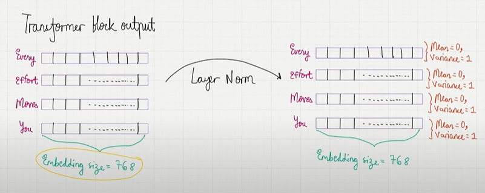

## 7 : Output Head 

- Output head is a final stage in the gpt model it's a neural networkk
- each token as 768 dimesnios,..
- we pass this through a neural network whose size is a embedding dimension(768) multiply by the vocabulary dimesnions(50257)
- if u multiply we will get something called logits  it actually has 4 rows because we have 4 tokens and num of columns is vocabulary size..
- for every token we have this logits which is 50257 dimensional vectors..
- the reason is we wanted to predict the next word right based on the input..when "every" is the input we want to predict whats the next word that should be "effort"
- we look at the this logits and we look at that columsn which has highest values and that column take the token Id check the token Id in the vocabulary that should automatically coressponds to "Effort".
- when "Every Effort" is an input we will look at the column which has  maximum value get the token Id compare with vocabulary..that word in the column should be move...
- Based on the final output we get the next word prediction...
- 4 X 50257 - num of tokens x vocablary sizee
- If we have multiple batches then it will be change as 2 X 4 X 50257.because the batch size is 2...

    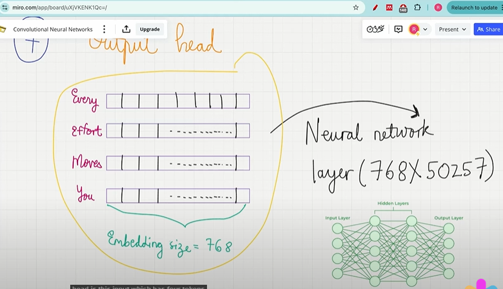

    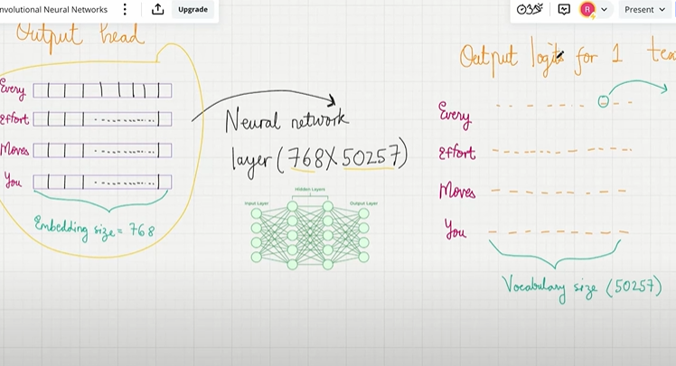

## Coding 

- let's look at the forward method it will take an input.Input is like this..here we have 2 batchess...each batch has 4 tokens..
    
    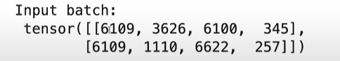

- batch_size is num of rows and seq_len is equal to num of columnss...
- first we converts the tokens into token ids and then convert into token embedding.
- we intialize the embedding layerr
- we get the positional embedding for the embedding vectorss for the positions..
- we add the token embedding and positional embedding to get the input embedding...
- next step is call dropoutt
- call transformer block
- call normalization layer
- apply the output heads

- In the configuration num of heads is 12 right..are actually chaining 12 transformer blocks together..using nn.sequential.
- this nn.sequential is pytroch module which allow us to chain different neural networks together...we have chained 12 transformer blockss'

    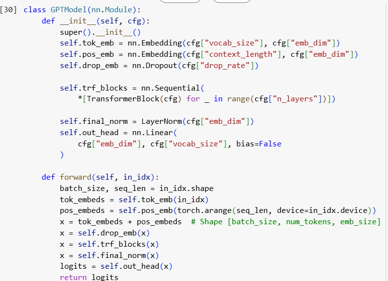