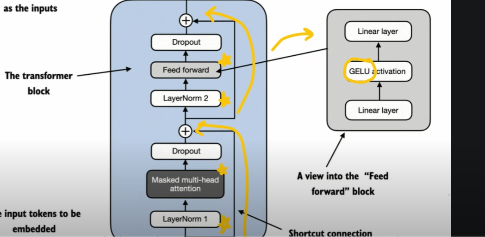
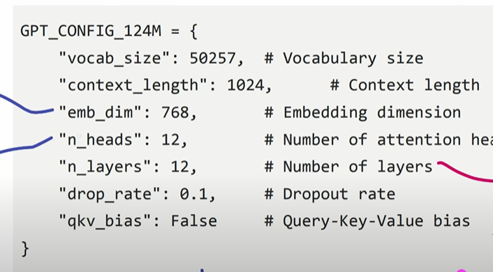

## LLM Architecture

- Input Tokenization
- Embedding(Vector + Positional)
- Masked Multi Head Attention
- Transformer Block
- Ouput Layer

## Configurations

- Vocab_size = 50257..It's a sub-word based byte pair encoder[ Tokenization ]
- Context Length = 1024 is like how many maximum words we need to use to predict the next word..
- Embedding dimension = 768, every token will have project into vector dimensions.
- Number of Heads = 12 this are multi mask attentions heads..
- Layers = 12 this is like how many transformer layer we need to have..
- drop_rate = 0.1 which is a drop-out rate.
- qvk_bias is false..

    

## Transformer Architecture

- Layer Normalization
- Gelu Activiation
- Feed forward Neural Network
- Shortcut connection