## Generate Output From Output Tensors

- To generate a output token, model is given a context size that's a maximum number of tokens which the models looks at before it predictint the next word..
- In the 1st iteration is "Hello, I am" and the model has to predict the next token "a".

    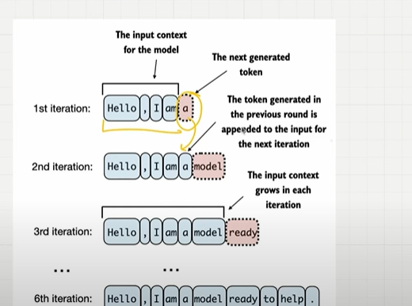

## Step 1 : Look at the output sensor

- Look at the output tensor that we have 4 tokens and num of columns is vocabulary size

## Step 2 : Extract the last vector 

- look at the logits and its not sum up to 1.
- Now in the step 3 apply softmax

    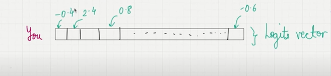
    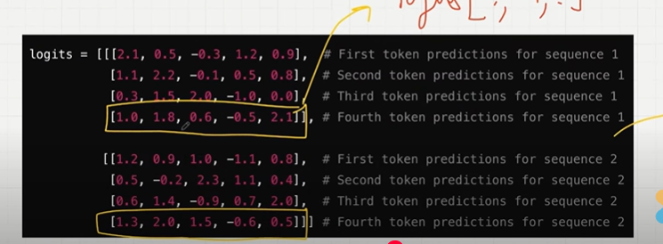

## Step 3 : Convert logits into probabilities by applying softmax

- Apply softmax
- Now it will sumup to 1.

    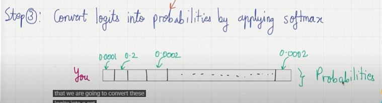

## Step 4 : Identify the index postionn(token Id) of the largest value

- identifity the index position of the largest value
- here 0.2 is the probability seems to be largest and then i find the index of the particular element and it's turns out token id = 57.
- now after the "Every efforts moves you" the next word is with token Id which is 57.
- go to the vocabulary decode the word which corresponds to the token id of 57. 
- hope that is equal to "forward"

    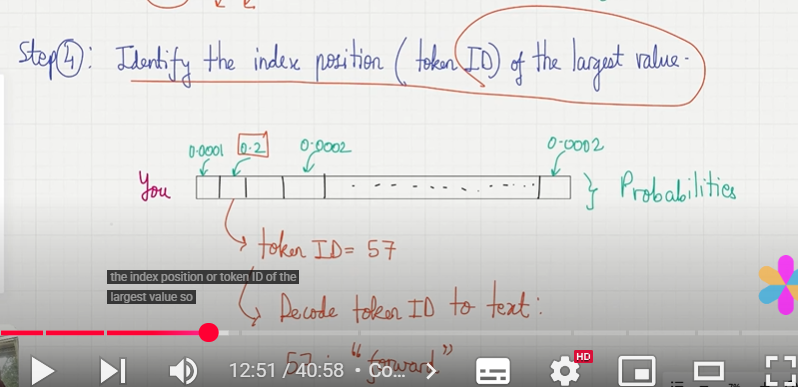

## Step 5 : Append token id to the previous inputs for next round.

## Step 6 : Output

- Final output
- this step by step process enables model to generate text sequentialy building cohernt phreases from the intial input context.

    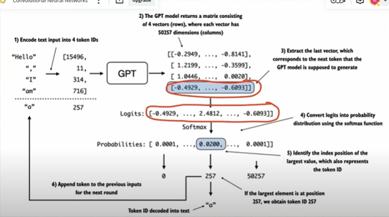

## Repeat the process

- repeat the process
- num of iteration we do it is based on the max_new_token.If it is set as 6, we iterate 6 times...

    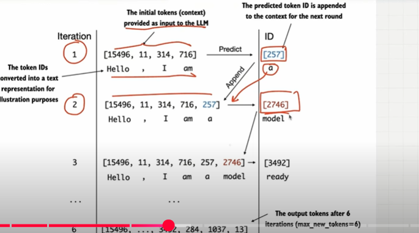

## Coding

- idk is input tokens with batchs 
- model is instance of gpt model classes
- max_new_tokens we need to pass and we also need to pass the context size how many words we need to look to predict the next word..
- number of words looking at LLM determines by the context size idx[:context size]..if the input token is 8 but the context size is 5 we only look at 5 tokens to predict the next wordss.if input token = context size it is fine..if not it will take the last elements which are equal to the context size..it will look at the last 5 tokens in the first batch and it will look at the last 5 in the 2nd batch
 
 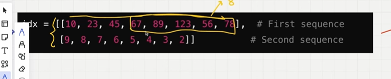

- we can pass this input to the model...model is gpt class..this is were all the main functions are happening..
- model will do token embedding, positional embedding..transformer block..it will return the logits tensor..
- dimensions are batch, n_tokens, vocablarysize which is (1,4,50247)..

  

- we need to extract the last row from this logits tensor..
dimensions become batch,voab_size
    
 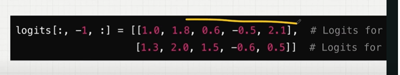

- Apply softmax to convert these probabilite, each row sum up to 1.
   
   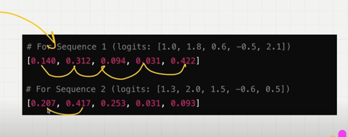

- the final step is took the index with highest probability value

- And in the last step, append the idx_next to the input..so that becomes input to predict the next words..for the next round...

    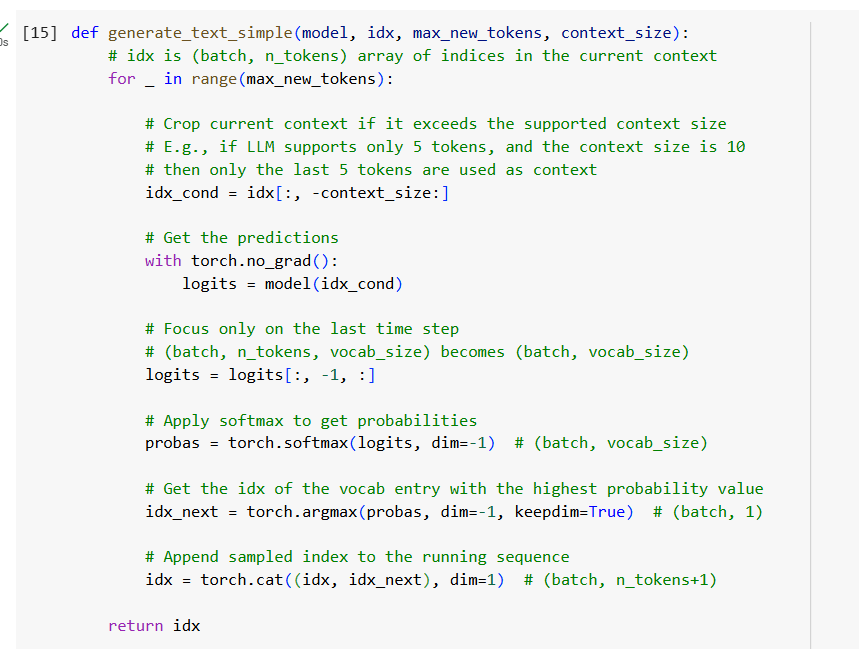