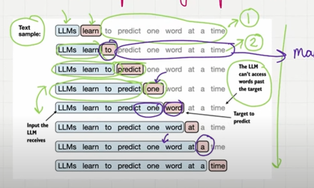
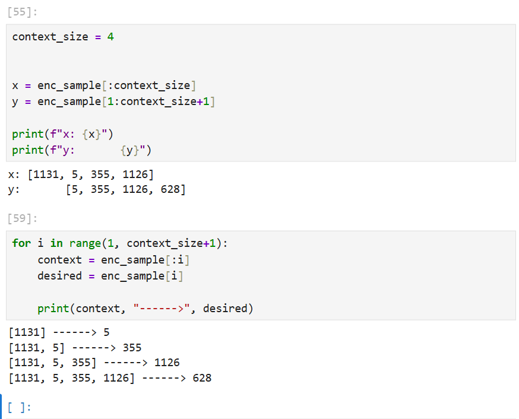
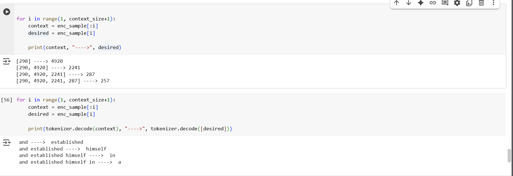
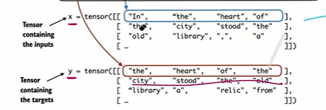
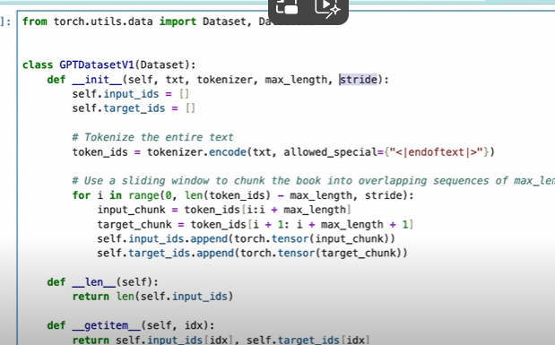
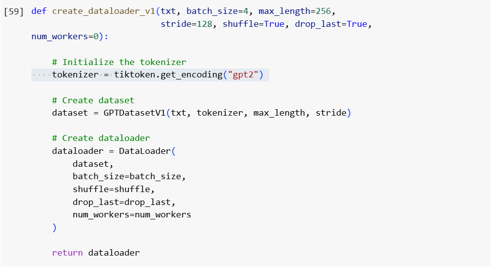
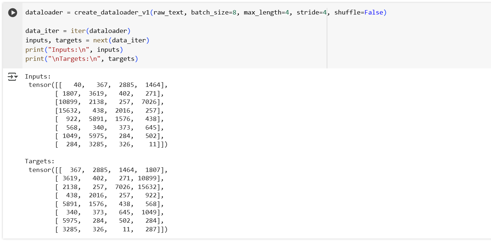

## Create Input Targets using DataLoader using Sliding Window approach.

- We given the input and we will predicte the next word as an ouput in the first Iteration.
- And in the second iteration, the ouput of the first word as taken as an input and it will predicts the next word.And so on it will go.
- For that first we need to define a variable called context size, context is maximum length the input recieves at the time.it will be 500 or 2000.
- we implement the dataloader that fetches input-output target pairs using a sliding window approach.

    

    

- If **and** is input it will predict the next word **establish**.
- And if the **and** and **establish** is an input it will be predict the next word **himself**.
- d if the **and,establish** and **himself** is an input it will be predict the next word **in**.
- And so on.
- we implement a simple data loader that iterates over the input dataset and returns the inputs and targets shifted by one.

    

## 1. Data Loaders using sliding window approach

- To implement this first we can collect input in tensor x where each row is one input context and second tensor y contains the corresponding prediction targets(output)
- Each row in x will be a input context and the each row in output y will be ouput context which is shifted by 1 word..
- tensor is a multidemionsinal array.
- The first row of input and the first row of output will be an input-output pair.
- we can create batch based on the context size, batch can have multiple inputs
- Based on the stride we can move the position for next word prediction.
- if stride is 1 we will have overlap, make sure the slide is equal or more than context size so it will be any overlap.

E.g: 5th row in x tensor is a input context and 5th row in the output y will be the output context.This is input-ouput pair.

    

## Construct a Dataset

- The library we are using this import dataset and dataloader from the torch.
- This will accept 4 inputs, one is txt, tokenizer, max_length and stride this is like a how much input needs to be slide like 1 or 2 for next words.
- we can create 2  tensor one for input tensor input_ids and target tensors target ids.
- create the input and output tensor append the 2 input variables.
- Append the input and output chunk based on the condition variables loop over the entire text and append it.
- At the end we have inputs and output and using get items based n the index it will return the first row of the input and the first row of the output.

## Paired the dataset with the dataloader

- create a dataloader first.
- Dataloader implement the ouput in structured manner.we can extract the input and output from the dataset.
- we can define stride which how many stride to the next word it is called sliding window approach.
- we can define the batchsize, if we define batch size as 8.It will take 8 rows.
- max_length is a context, context is like how many words 4 or 5.
- stride length will be equal to max length, so not over lap..
- Data loader will helpful to manage the input of the data like how many stride, batch_size and max_length.

    

    

- we can also batch_size as 8.we have 8 inputs and ouputs and we have stride 4. 

    