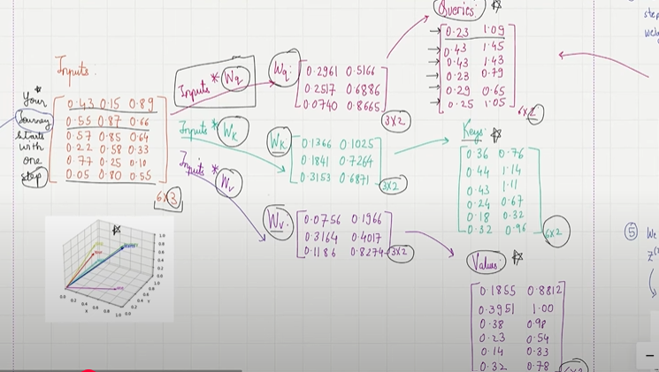
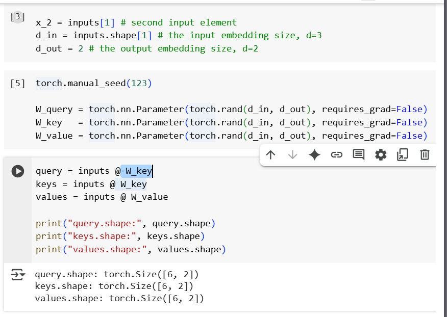
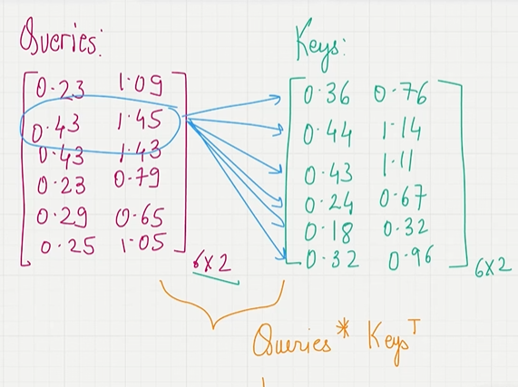
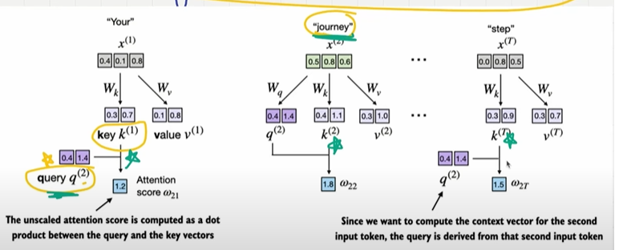
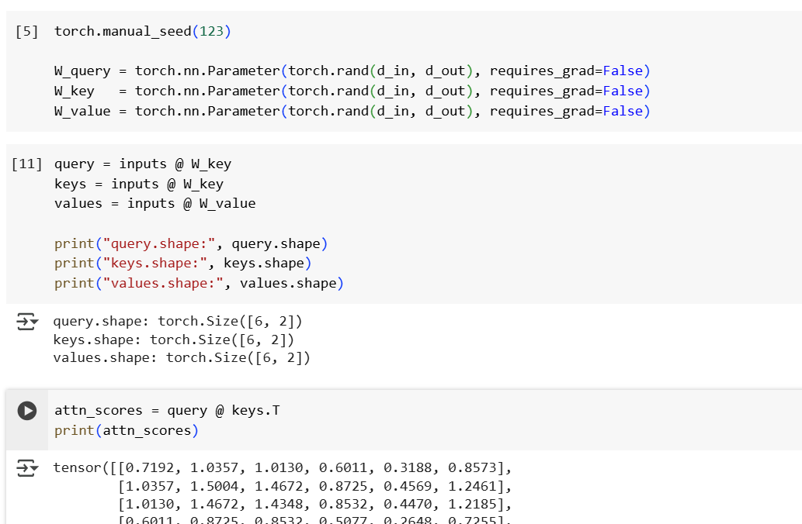
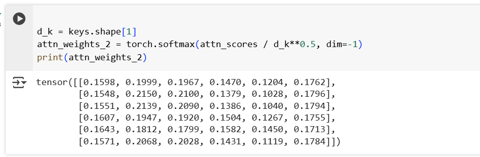
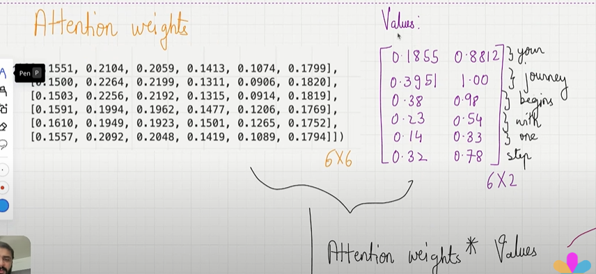
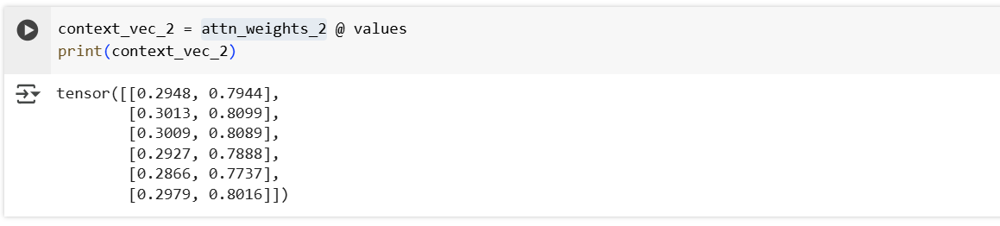
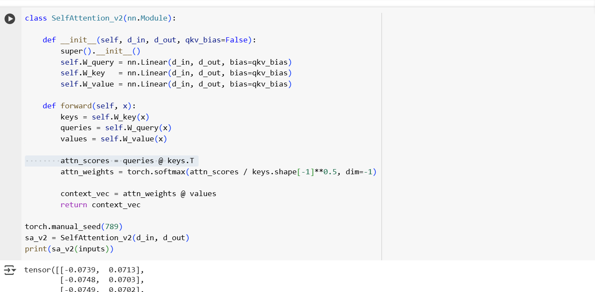

## Self Attention with Trainable weights

## 1. Convert input embedding into key, value and query vectors.

- It is also called as Scale dot production attention.
- we have to costruct into three training weight matrices  query(wq), key(wk) and value(wv).
- we need to input * wq, input * wk, input * wv.
- These are optimized later.

    

- Input is a tensor with the vector embedding.
- Usually input and output dimensions are same, but we for sake of this training..we can give the d_in and d_out which is 3 and 2.
- Now we need to compute the query,key and value.

    

## 2. Attention Scores

 - If i am predicting the next word how much important should i need to give to other words..
 - we need to find the attention score..
 - lets say we have a word "your jounrnery starts with life"
 - for this vector embedding we have query,key and value..
 - now we need to consider "Journey", we take query(2) which is journey calculate the attention score with each words.
 - query(2) and key(1), query(2) and key(2), query(2) and key(3) and son on this how we calculate the attention score for each.

    

    

- we need to calculate attention scores for each quereies.

    

- they are not sum up to the 1, these looks like random values..we need to normalization..we can make interpretable..when the queries is journey we can say give 20% attention or 30% attention this one..
 - it helps in backpropagation..
 - for this we need to do softmax.

## 3. Attention weights..

- we need to do normalization to sum up to 1.
- And we need to scale the attention scores by dividing them by the square root of the embedding dimension(d_k)
- we can use softmax to normalize.

    

## 4. Context Vector.

- Multiply the  attention weight with values(pv) and then sum up everything...

    

    

## we can use linear instead of nn.

- basically it will give efficient weights in the model to train.

    