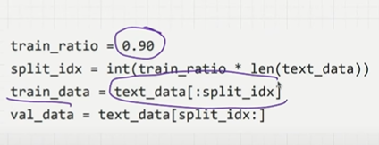
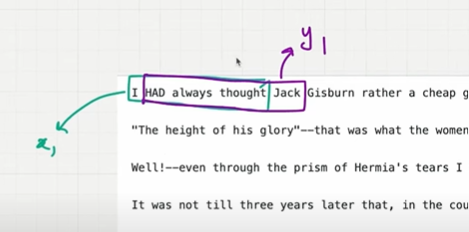
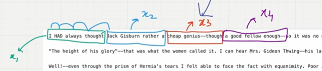
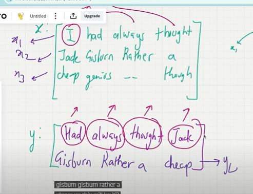
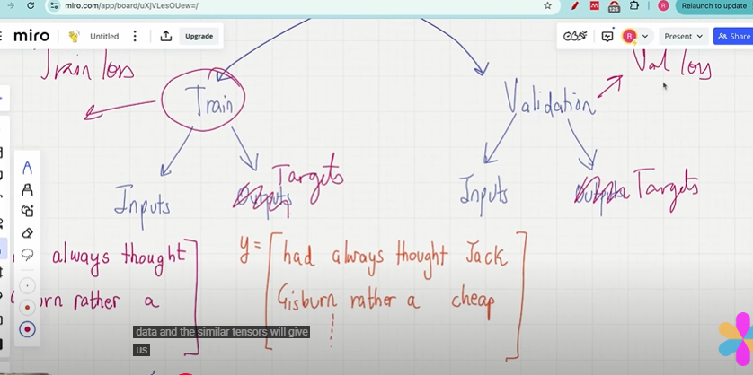
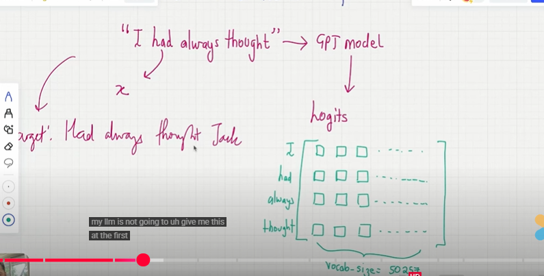
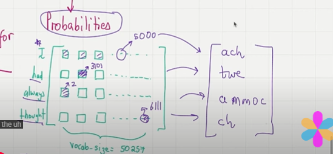

## LLM Training and Validation Loss

- we split the training data 90% and val_data 10% from the dataset.

    

- LLM are autoregressive models from the text itself we construct the input and output...

- we can use Dataloader to chunk training and validation data into input and output datasets..

- Need to set a context_size, context_size is like how much data LLM needs to see before predicting the data..here we can take context_size as 4.
- since the context size is 4..In the dataset i will take first 4 words as an input which is x1 and input shifted by one is an output which is y1.

    

- Now we need to construct another set of inputs and output.for that we need to mention stride...stride is like how much we need to move after predicting the next word..In our case stride is always same as context_size..so stride will be 4.so we move 4 words...
- No overlap bt inputs..

    

- Now the final datsets be like input tensor with stride 4 with is x1,x2 and the output which is target actual values and tensor which is input shifted by 1 which is y1,y2 and so on..
- we do like this till we reach the dataset...

    

- so this input will be passed into LLM Model will get the LLM output...
- after we find the loss bt LLM Output and target..
- Now we have training loss and validation loss after we pass through the model...

    

- Now take the first input and pass it to GPT Architecture you get the outpt logits and take the target also..

    

- Take the logits use softmax to sum up to 1 and now look for every row in the logits..what's the highest value take the token id and check with the vocabulary and u will get some random output..because it's not trained...
- now in the next row..look for the index which has highes val..take the token id check with the vocabulary..now will u get randome val
- these are output token LLM is predicting

    

- now take your target, take token id of "had" which is 23..now in the logits  first row which is "I"
 look for 23 in the colums mark the index as p1.
- now again take your target, take token id of "always" \ which is 3881..now in the logits in the second row "I Had" look for 3881 mark the index as p2.
- do it for all..

- use cross entropy loss to calculate the loss bt ouput and targets...