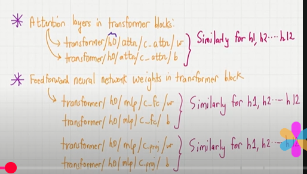
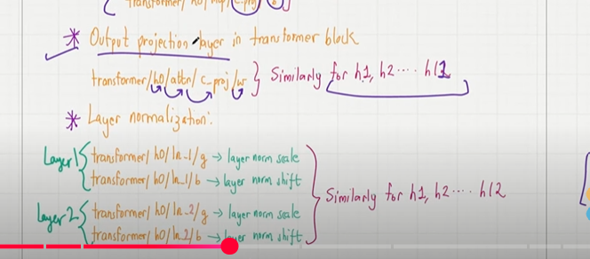

## Loading pre-trained open AI weights

- load pre-trained weights from open AI into out LLM Model
- In our LLM, we trained GPT with a small datasets using a book right.
- this give us result but we didn't get the proper meaning of it..
- Open AI shared their weights publicly..we are going to loading this weight into out GPT Model..for next text predictions..
- open ai saved their weights via tensorflow..and we use another libaray called tqdm for download tracking...
- we have this download_and_load_gpt2() to download all the files from the openapi modules..
- settings contains the configurations..
- params contains all the weight tesnors..

Files : 

- Checkpoint : It is the path where all the current parameters weights of the gpt2 models are stored.File : "model.ckpt-data".
- Encoder File : it's a vocabulary contains tokens and tokens ids..vocab_size is 50257
- vocab.bpe : it's a byte pair encoder..sub-word tokenization..this file will tell the tokens that are merged..with the highes probabilitty
- hparams : configuration details..

- Dictionary will have 5 keys : 

1. wte - token embedding will require trainable weights
2. wpe - positional embedding will require trainable weights
3. Blocks
    - Attn need key,quereies and values have trainable weights.

        
        
    - Feed forward needs expanison and contradiction there we need trainable weights.

4. Final norm scale - Layer Normalization will have trainable weights
5. Final norm shift - Layer Normalization will have trainable weights

    