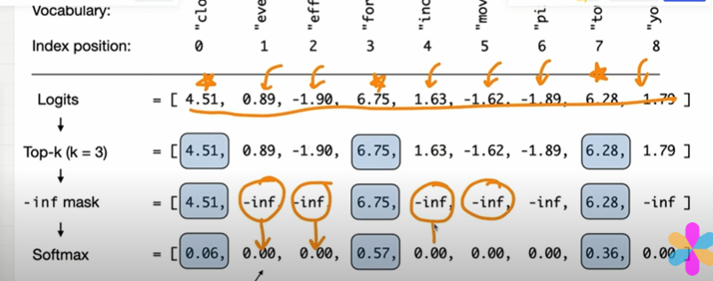
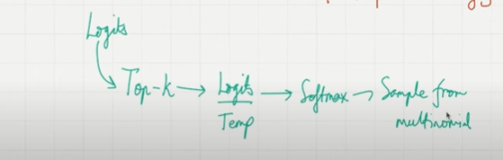

## Top-K Sampling [De-coding startgies]

- even though we are introduced temperature scaling..let say we have "Every efforts moves you" is an input sometimes we will get "Pizza" being next token.
- if temperature is 5% about 4% chance the next token is being the pizzaa
- if we use temperature scaling all the words are in the picture of become next token based on the proabability score...we don't want that.we wwant to restrict that opportunity of being the next token..we only want to give to a few number of tokens,...
- using top-k sampling we want to restrict the opportunity of being the next token to only few tokens..
- restrict the top-k most likely tokens and exclude all other tokens..
- if k=3, we only look logits more than 3.
- All the others which are less than 3 which are not even in the picture at all...replace all these value with negative infinities..
- when we take a softmax all these will turned as zero.
- then they will not contributes to the next token..

    

## Coding : 

- assign top_k value which is 3.
- using torch.topk we can only return the logits which are greater than 3.
- after in the logits value with less than 3 we can add negative infinity..
- we can use softmax the negative inifity to zero..

    

## Flow will be

- get the logits
- apply top-k
- divide the logtis by temperature..
- apply softmax
- applu sample from multi-nominal

    