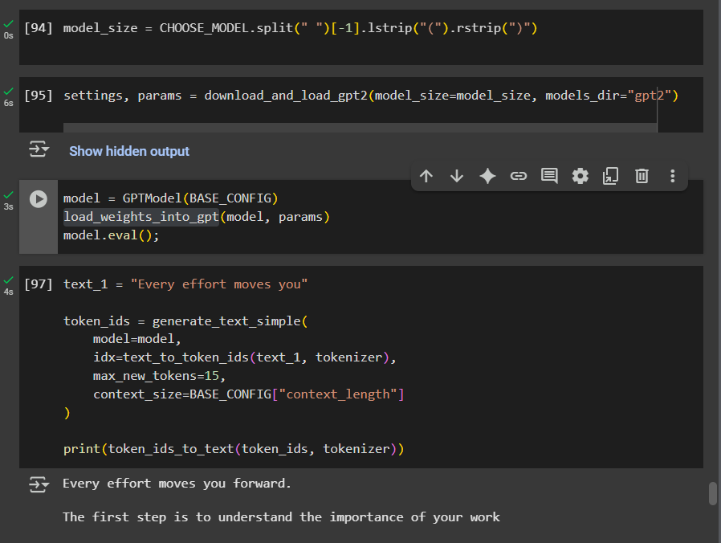
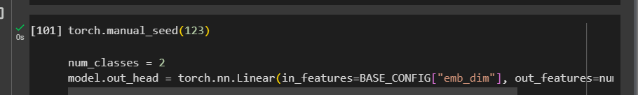
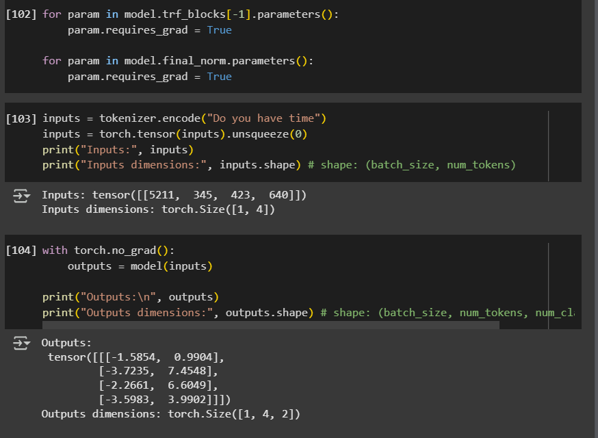
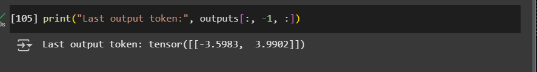
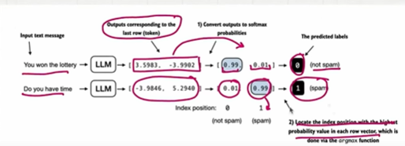
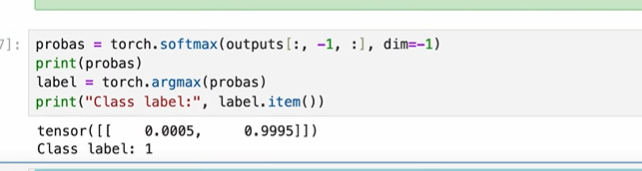
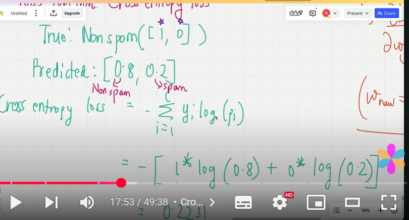

## Model Initialization with pretrained weights

- In the code we define the model of 124 M.
- we set base_config like voc_size, context length..
- update the base_config with config model..
- And the condition - we are going to remove all the token which are higher length than the context token..

    

- download the gpt2 parameters..and return settings and params..
- settings contains configuration details and params contains trainable weights..
- we can define the model and using load_weight_into_gpt we can load the weights into gpt model..

    

- without any classification or finetuning the model lacks the perform for checking spam or not spam

    

- modify the classification head
- In the final output layer of transformation, instead of vocab_size in the column we need to replace with spam or not spam..2 columns..
- add a classification head only 2

    

    

- freeze all the layers...we can use req_grad=false to freeze all the layer..we are not going to update..freeze it..all the parameter...

    

- Not necessay to fine tune all the layers - only fine tune the last layer...make trainable last layer..make req_grad = true for all the layers..

    

- 12 transformer block - fine tune the last year..no need to fine tune all the blockss..reduce computation..

- final output..final norm layer..final transformer..we can freeze the others..

- we can take the last token it has all the values..

    

- Then we take the input
- we get the result which is the last token
- we apply the softmax on the result, so that it the probabilities will be sum up to 1.
- based on the highest probabilites..then we can take on the index we can choose whether it is spam or not spam

    

## Coding

- we apply softmax so that the probability will be sumup to 1.
- Now take the index of the higher probabilities
- the code returns index 1, meaning the model predicts the input text is spamm.

    

- now we apply this approach to our batch..we can have another label called predicted output label which contains predicted yes/no by the model.
- we have a target label already we have...
- now we can compare these two..
- we define the calc_accuracy_score function..and the dataloader..so let's say if you are given a training dataloader..
- if num of batches is not specified..we are going to use length of the data loader..
- iterate each batch ..each batch have 8 samples..find the logits..logits of the output token..one batch has 8 samples..so i has 8 tensors..apply argmax..
- compare the target batch with the predicted labels..

- we can calculate the training,validation,test accuracy for each training dataser..

- we have a target which is true value and predicted valuuee..we need to define the loss function..simply take the partial derivates of loss function with trainable weights..
- we update the parameter until the loss function is minimize
- if the target is yi and the prediction is pi..then the loss function we use in this case is cross entropy loss.

    

- we get the input batch and target batch..pass in through the model..only look ath logits of the last output token..
- find the cross entropy of this logits tensor and target batch...

- calculate the loss of multiple batches..
- we are going to take one input batch and 1 target batch..calculate the loss for each batch..using categorical cross entropy..
- everytime we get the loss we can add the loss..
- divide loss by total num of batches..it will give avergae loss per batchh
- this is the loss we are going to minimize using back propagation..
- now we need to fine-tune

- one epoch will going throught the entire dataset once..
- loop withing each batchess.
- look at each particular sample
- calculate the loss
- backward pass to calculate the loss gradients.
- update the model weight..
- in next iteration reset the loss of gradient..