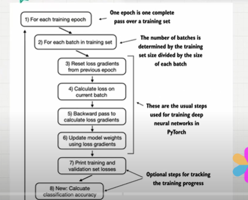

## LLM Fine-tuning using training Loop

- Training loop
- Loss functions..

    

 - Iterate through the batch
 - if loss gradient is there we will reset..
 - backward pass to calculate the loss gradients..
 - update the model weight using lose gradients..
 - print the validation aset losses..

 - loss function is calculated by target(true_value) and predicted output..

- using ollama we can do evaluation of the text