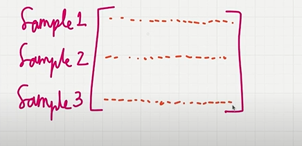
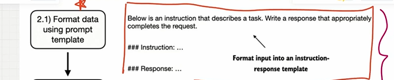
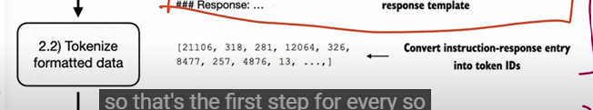
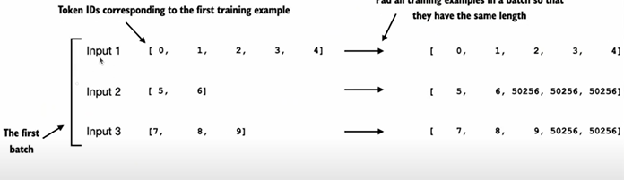
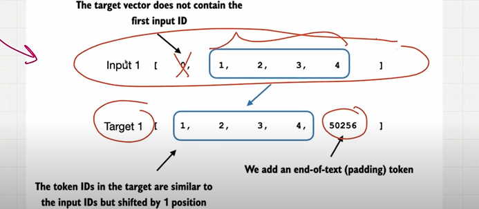
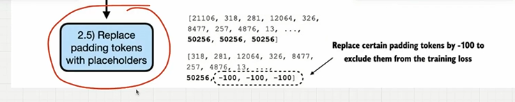
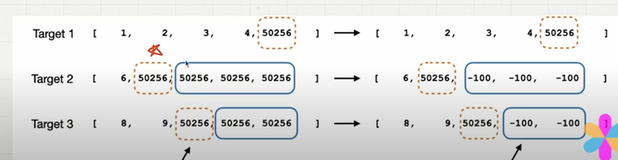

## Organizing the data into training batch

- first we need to convert all the datasets to the batch.
- the first row we can convert it from the numerical dataset..
- so that the size of the first row is same as size of all the rows in the batch.size means num of columns

    

## Step 1 : 

- first we have data we can format that data using alpaca format so that prompt can understand..

    

## Step 2 : 

- we can use tiktoken to tokenize the formatted data..
- it takes the sentence and convert it to the token id..
- convert the entrie prompt to token id..

    

- num of tokens ids will be different for each text messages in batch..
- we need of token ids each will be same..

## Step 3 : 

- Adjust to the same lenght with padding tokens..
- we are going to add padding..
- we add end of text token id in all the text message so that there length will be same

    

- take the length text message with token id larger..now pad them to end-of-text token id in all the other text message ..so that all the text message will be equal to the longest length
- so length will be same for all in a batch
- do it for all the batches...
- so that in a batch all the tokens will have same length..it's easy to process then.

    

## Step 4 : 

- create target token ids..
- for that takee the input token..now for the target input is shifted by 1.
- we can add a padding end-of-text token id in the last
- so that length of the target and length of the input is same
- example
- if "below" is the input.."below is" is the output
- If "below is" is the input.."below is an" output
- if "below is an" is an input.."below is an instructions" is an output..

    

## Step 5 

- replace padding tokens with placeholder

    

- make sure in all targets..u have only one end-of-text token id others replace them with the  -100.
- when we calculate the cross entropy the token ids with -100 will be ignored..in pytorch -100 will be ignoredd..it won't affect the loss function.

    