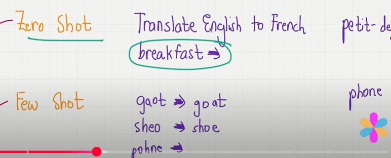
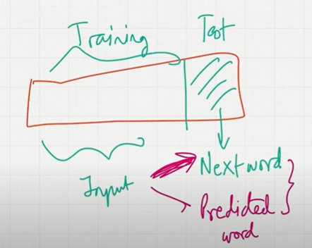
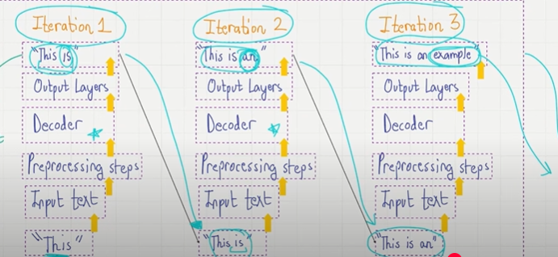

## 1. LLM - Large Language Model

- LLM is a neural network.
- Designed to understands and generate humans like text.
- **Large :** Previous models have only few parameters but LLM can have millions and billions of parameters.
- Specially designed to do NLP Task.
- **What is the secret sauce :** Transformer Architecture.

## 2. Stages of Machine Learning

1. Pretraining(foundational model)
2. Fine Tuning.

## 3. Pretraining + Fine tuning

- Collect and get the data from different source like datasets or from books, from Internet,wikipedia and research paper.Mostly this are unlabelled text[raw text].
- Train the LLM using this unlabelled datasets, this is called pre-training(foundational model).Each words will be considered as token.For training the LLM we need larger gpu.
- Once you pre-trained the LLM, we need to fine tune the LLM for your domain purpose doa a specific task, for finetuning it you need labelled datasets.After the trained pre-training LLM you need to further train on labelled datasets.
- Two types of finetuning : **Instruction finetuning and fine tuning for classification task**.
- **Instruction finetuning :** Instruction answers paired on labelled datasets.
- **Finetuning for classification task :** Labelled datasets consists of text and associated labels.(Spam / Not spam).without any instructions..train the model predict the whether it is spam or no spam.

## 4. Transformers.

- Original transformer development is for machine translations like english to german or french.
- **Input :** This is an example.
- **Input the data and pre-processing :** Preprocessing remove the unwanted data and break the sentence into words, each words will be considered as token. for each tokern a token id is generated with random number.
- **Encoder :** Pass the data to the encoder.
- **Convert Embedding :** Add the vector embedding to the token.Vector embedding gives the semantic difference to each word.E.g : Human - King, Woemen, Men. and Fruits - Apple, Mango, Orange.
- **Decoder :** Decorder will receive the predicted translated word for each word, decorder will receive this as a input and decorder will also recive the the vector embedding.
- **Output :** Generates the translated text one word at a time and format as a sentence.

## 5. Encoder and Decoder

- **Encoder :** Converts a text into a vector embedding.
- **Decoder :** Generate output text from the vector embedding.

## 6. Self Attention Mechanism 

- Allow models to weight the importance of different words relative to each other.
- Long range dependencies.
- **Predicting the next word :** Self attention mechanism will tell which word you need to give more importance to predicate the next work.
- Calculate the attention score to tell which word we need to give more importance for predicting the next word.

## 7. GPT - Generate Pretrained Transformer.

- Decoder Architecture.
- Look sentence from left to right.

## 8. BERT.

- Encoder Architecure.
- Look sentence from both directions and understand the realtionship between words.
- Used for sentimental analysis.

## 9. Zero shot, One shot and Few shot Learning.

- **Zero Shot :** The model predicts the answer without any prior specific example.Translate english from french, Cheese = ?.Now it predicts the french word.

- **One Shot :** The model sees the single example of the task.E.g Translate english from french, Hello = halo(french), Cheese = ?.Now based on the single example we gave it predicts.

- **Few Shot :** The model sees the few example of the task.E.g Translate english from french, 
Hello = halo(french), Hi = Hai(French), Cheese = ?.Now based on these example it predicts.

- GPT is a few short learner as well as zero short learner. But if you give few examples the answers will be more accurate.GPT also do zero short learning provide you the result but the result maybe inaccurate.

    

## 10. Pretraining datsets.

- For training LLM we need billions or trillions of parameter, for pretraining the LLM fo this much datasets we need to make sure we have compute power like gpu.
- Pretraining can be done from common crawl, webText2, books, research paper and wikipedia.
- Pretraining is unlabelled datasets, because here the sentence itself used as a labelled...were we predicting the next words.
- Token is a unit of text.Each word we can consider as a token, 1 word - 1 token.
- pre-training the data after finetuned with labelled datasets for your own domain.
- we have lot of open-source LLM available.
- finetune LLM outperforms the pretrained LLM on the specific task. 

## 11. Next wrok prediction

- Self Suprvised Learning.
- Sentence itself training data and test word is next data.Using neural network we can keep on updating the weight untill loss is minimum. we keep on predicting the correct word.
- The structure of the data itslef as a training data and the next word in a sentence used as a label.
- Auto regressive model will use previous output data as an input data for future prediction.

    

## 12. Original Transformer Vs GPT

- **Original Transformer :** will have 6 Encoder and Decoder block.
- **GPT3 :** will have 96 decoder blocks with 175B parameters. 

## 13. Next Word Prediction working 

- we can have upto 96 Decoder blocks.
- On the first Iterations, it sends as an input to Iterate 1.The data will be pre-processed like sentence will break into words.Each word is a token with token Id.
- And it will send to decoder and predictes the next word.
- Since it is a auto agressive model the first iteration output will send as an input to the iteration 2 and now in the iteration 2 it will predicts the next word.
- And finally we can have our output.
- Because of all this its an unsupervised learning.

## 14. Emergent Behaviour 

- we train the LLM with large datasets.
- Although it was not supposed to trained on the particular task, it will give the result.
- for eg. Multiple choise question. we didn't trained the model to generate the multiple task question.
- But they noticed it can perform all other tasks.
- That is called emergenet behaviour.
- In training model learns the statistical relationship bt the words and sentence...