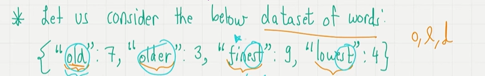
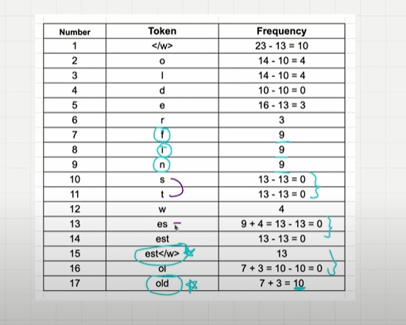
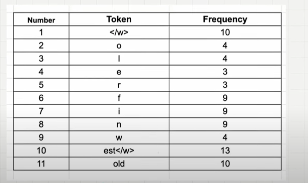

## Tokenization Algorithm

- Word based algorithm,
- Character based algorithm,
- Subword based algorithm.

## 1. Word Based Algorithm

- Breaks the senctence into word is called as tokens.
- **Problem:** If the words are not there it will throw out of vocabulary(OOV) words.
- **Problem:** Different meaning of similar words(boy, boys)..each word has a token.The similiarity is not captured.

## 2. Character Based Algorithm

- Splits each text into each character and assign a token for unique character.
- Very small vocabulary, we only have fixed number of characters(english = 256 characters).
- Solve the Out of vocabulary(oov) problem.
- The meaning associated with the word is completely lost.Tokenized sequence is much longer than the initial raw text.
**E.g :** dinosaur - 8 tokens..

## 3. Sub-word based Tokenization.

- **Rule 1:** Do not split frequently used words into smaller subwords.
- **Rule 2:** Split the rare words into smaller, meaningful.

**E.g** 
"Boy" should not be split.
"Boys" should be split into "boy" and "s".

The subword splitting helps the model learn the different words with the same root word as "boy" like "boys"

## 4. Byte Pair Encoding is a Subword Tokenization Algorithm.

- Look for the consectuive common pair of character in a text and replace with a single character which is not present.Till all the character will be single digit.

**Orginal Data:** aaabdaaabac
- The byte pair 'aa' occurs the most, we will replace it with Z.with Z does not occur in the data..
- **Compressed Data:** ZabdZabac.
- The next common pair is 'ab'.we will replace it with y.
- **Compressed Data:** zydzyac.
- The next common pair is 'zy'. we will replacw it with w.
- **Compressed Data :** wdwac
- Everything appear only once.so we don't encode..

## 5. BPE Algorithm used for LLM.

- BPE Ensures most common words in the vocabulary considered as a single token.
- While rare words are broken down into two or more subword tokens.
- for frequent pairing, merge them and perform the same iteration again and agian until we reach the token limit.

- The above list of 11 tokens will serve as a vocabulary.