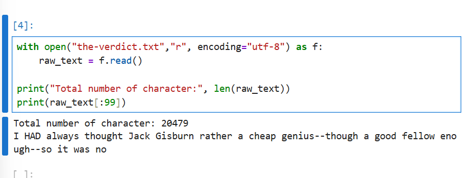

## Data Preparation and Sampling

## How do you prepare a input text for training LLM ?

- One of the way is a word based Tokenizer
- Break the sentence into a individual words for a token or tokenization text.
- Assign tokens Ids into each token.Each token Ids are associated with the token.
- Encode the token Id with vector embedding.
- After that it will fed as an input data to the gpt.

    

## 1. Load the file in Jupyter Notebook.

- Upload the file in jupyter notebook.
- And then with_open to check how many characters and the words.

    

## 2. Split the Sentence to tokenization

- for splitting the sentence we can regular expression libaray.
- split() function to split whitespaces(\s), comma(,) and full stop(.) and now you can print the result.

    

## 3. remove the whitespaces.

- Removing the whitespace to reduce the memory and computional.
- But python is case sensitive, for training LLM we need to have white senisitive it has some meaning.
- White spaces are important, because indedention matters for sensitive the data.

## 4. Split the sentence with special characters.

- We have some more special character, we need to split all those special character.

    

## 5. Split the actual dataset in the raw_text

- Split the actual text with spaces and special characters as token.
- Remove the spaces using strip() to remove the white spaces.
- print the length.
- And now we splitted the text it's called token.where each text is a token in word based tokenizer.

    

## 6. Assigning a token Id to token.

- Once we created a token, we need to build a vocubulary.
- Vocubulary is a list of token in an alphebectical order and sorted ascendingly, removing duplicates.
- Each unique token will be mapped to the unique integer called token Id.
- We have billions of data, Vocubulary will be hugee.

    

## 7. Creating Token Id for raw text.

- Convert our data as set sort the set alphabetically.
- Once you sorted you only get unique text, duplicates value will be removed.
- Assign the unique text a unique number and print it, for this you can use enumerate to print the iteger based on the words.
- Dictionary contains indvidual token associated with the token Id.

  
  

## 8. Implement a Tokenizer class for Encoder and Decoder.

- Encoder methods gets the input as text, convert the text into token and token Ids.
- Decoder method gets the token Id as an input, convert the token Id to token and the actual text.

    
     

## 9. Create a class for tokenizer encoder and decoder

- If you didn't pass the input that are not present, it will throw an error.Because it's not in the training datasets.That's why we need to train larger datasets.
- Create an class and checks for encoder and decoder, we can have 2 function.one function is for encoder and and another function is decoder.
- if we call encoder with input text, it will give us token ids.
- if we call decoder with token ids, it will return the text based on the token Ids.

## 10. Special Context Token

- We can train the model to handle the unknown words. If the word is not there in the trained data or in the vocabulay it thrown an error.For that we need to use special context token.
- we have 2 things here **|ukn|** which is unknown word and **|endotex|** which is end of text.
- we have data quickly, if quickly is not there in the pretrained data..It will take |ukn|.
- End of text, let say we are training multiple resource like book, reseach paper and after each source is trained we can add |endoftext|.so that model can know where is the ends.

## 11. Adding Special Context token

- Add |ukn|, |endoftext| is the vocab and sort it and add token ids to these special context tokens.mostly these tokens are added as last.
- Here hello is not present it replace the unknown token Id and while decode will be unkown.
- we can add end of text for splitting the sentence.

## 12. Additional Special context tokens

- BOS(Beginning of sequence)
- EOS(End of sequence)
- Padding

## 13. Byte Pair Encoding

- BPE to handle the unknown words in the GPT LLM Models.
- Here the words itself divided into sub words that will be consider as a token.
- This automatically handles the unknown words