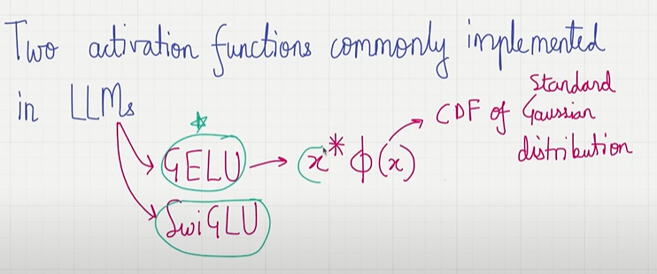
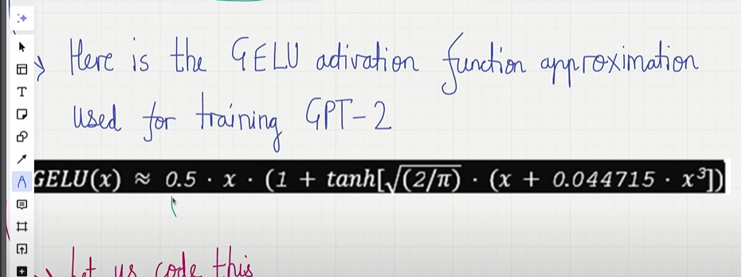
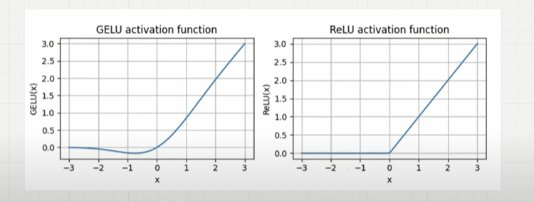
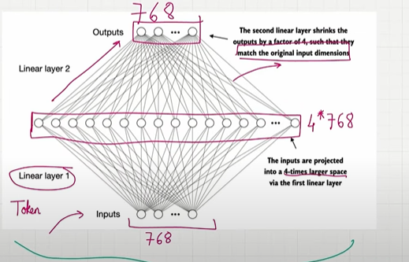
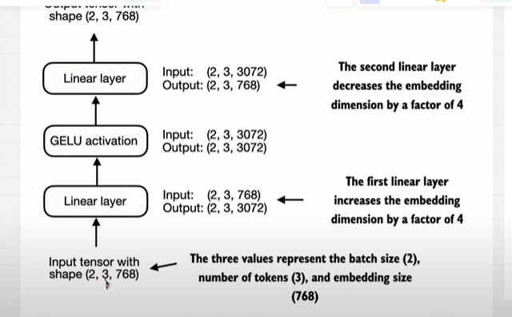
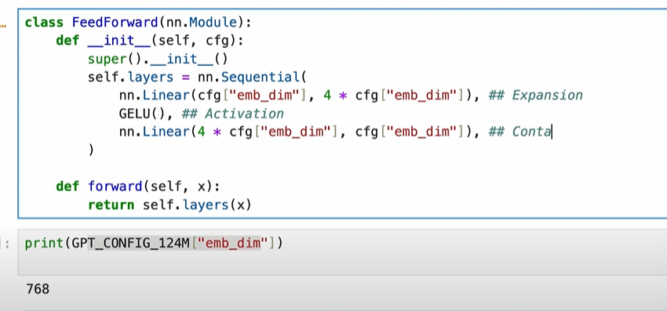

## Gelu Activation

- The activiation function commonly used in LLM
    - Gelu
    - SwiGlu

- Relu Activiation function is like if x is grater than 0 it will return the actual value but if it is less than 0 it will return 0.
- if u integrate relu in neural network it leads to dead neuron problem.If u have the negative value if u apply relu function the values states 0.The neuron will not contributed anything.. 

- Gelu product of x into pie of X its CDF of standard gaussian distribution.

    

- In Gelu, if the value x is higher its almost leads to 1.
- For Negative value, gelu will not be zero.

- Here is the Gelu Activiation function approximation used for training GPT-2

    

## Difference

- The difference between Gelu and Relu.

    

- In Gelu, for negative value the value will not be zero.it will solves the dead neuron problem.it allows non-zero output for negative values..
- Neuron gets the negative value still contributed to learning process.
- It's linear for longer value
- Gelu's smoothness can lead optimization during the training, gelu performs well in LLM.
- Relu has  short corner at 0 it makes harder.

## Feed Forward Architecture.

- feed formal neural network is a small neural network consists of 2 linear layers and gelu activiation function.
- In the first linear layer 1 if we do expanison, we will project the input into 4 times larger dimension to capture more properties between the input.If this layer is not there we are not able to capture the meaning bt some words..768 X 4 = 3072 dimensional.
- Taking one token input modifying each dimensions of the token place by place.
- Gelu Activation preserves the dimensions..
- In the linear layer 2, we can do contraction(compress) from higher dimesions into original size from 3072 into 768.

    

    

## Coding : 

- Sequential() helps to build a neural network
- first we do expanison original size will be projected into higher dimensions 4 X higher dimension
- then gelu
- the from the higher dimesnions compression  to original dimensions.

