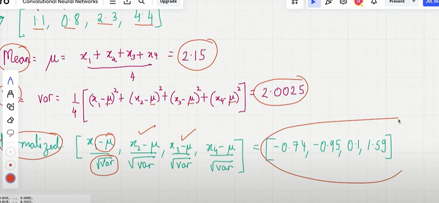
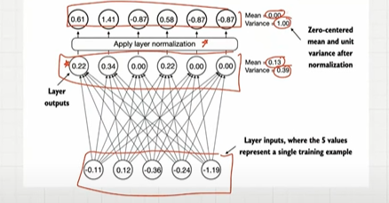
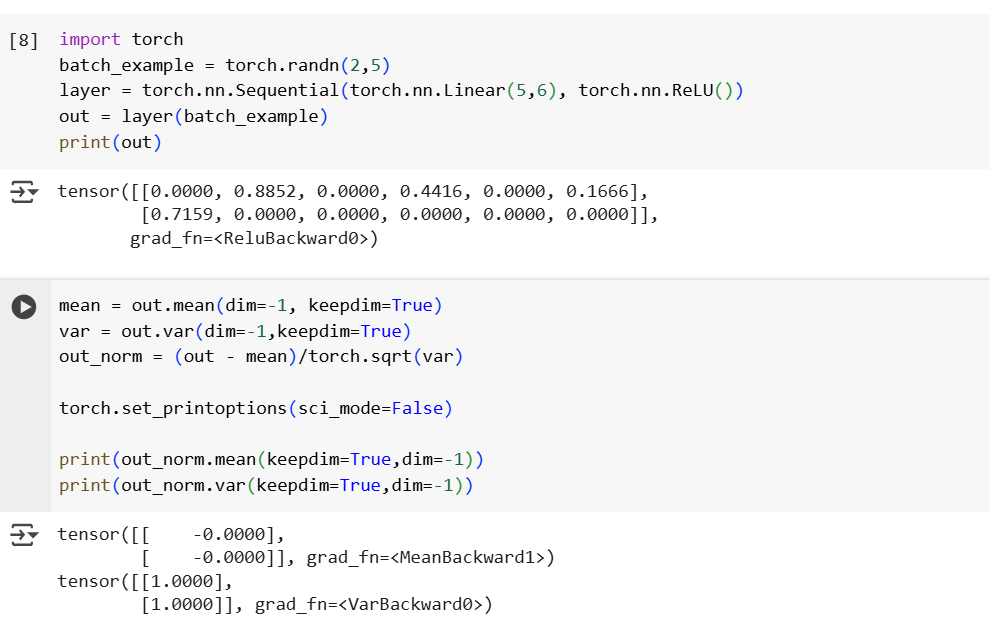

## Layer Normalization

- Training makes efficient
- But training neural netweorks with many layers can be challenging due to vanishing/exploding gradient..
- Unstable training dynamics..
- It imporves the stability and efficiency of neural networkk.
- the output coming for every layer is normalized.
- Input can change on based on the layer..Layer Normalization helps to prevent..Internet covarient changess.

- Main idea : ajust output of neural network to have mean zero and variance is one.

    

- Layer normalization appear before and after the multi-head attention and before the output layer..

    

- For each token we need to normalization, take the mean, variance and normalization.

    