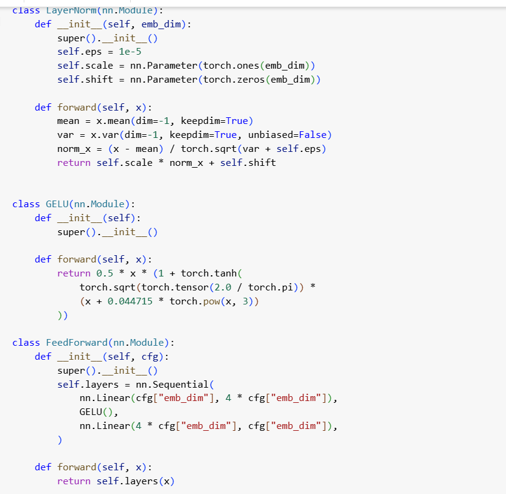
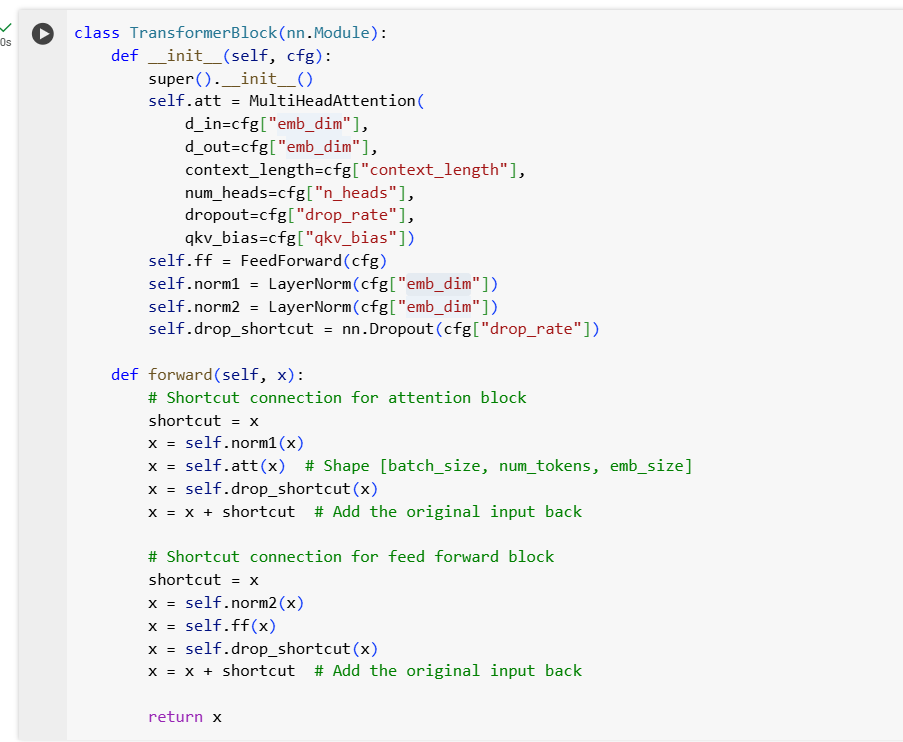
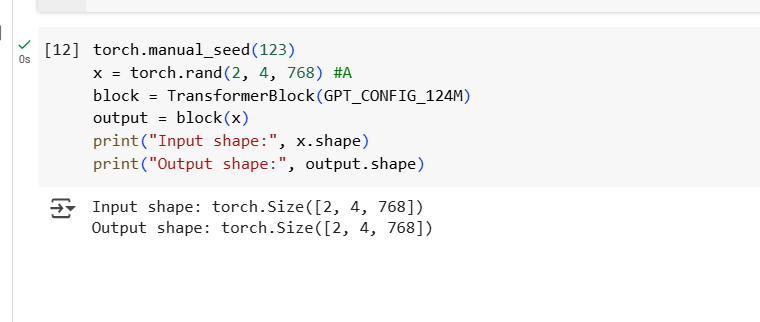

## Transformer Block

- Transformer block preserves an input sequences, each element is represented fixed size vector dimensions.
- The transformer input and transformer output dimensions will be same exact same..

## Transformer Block Code

- ## Step 1 : GPT Configurations

- ## Step 2 : Layer Normalization 

    - Takes input embedding
    - In layer normalization we can calculate mean,var and normalization.
    - Input - mean / sqrt(var)
    - using normalization we can normalize the mean = 0 and variance is 1.0
    - Scale and shift these are trainable parameter these need to learn in training.
    - Normalizations happens is like takes the indvidual columns make sure mean = 0 and variance=1.0

- ## Step 3 : Gelu Activation and Feed forward Neural Network

    - Makes sure negative value will not be zero and they are calculated non-zero values.
    - we need to have a gelu formula to calculate this.
    - Takes input and expand into 4 times higher dimensions and compression the output as same as input dimensions
    - Expanison, Relu, Contraction all these are called feed forward neural network.

- ## Step 4 : Class for Transformers Block
    - Insider a forward method :
    1)
    - Layer Normalization
    - Attention
    - Dropout
    - Shortcut
    2)
    - Layer Normalization
    - Feed forward neural network
    - dropout
    - shortcut
    
    - when we create an instance of transformer block..Multi-head attention class will be called.
    - This class takes vecotr embedding as input gives output as a context vector.
    - Mention input  as d_in = dim, d_out = dim[same], context_length = 1024, number of heads = number of attention heads, dropout is a to turn off the neuron.
    - whenever att() is called multihead attention instance of the class is initiated..
    - we don't need to create a class for shortcut.we can add the input to output using shortcut.

        
        
        