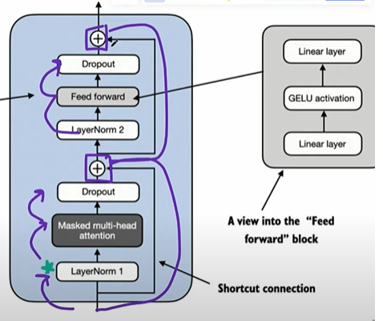
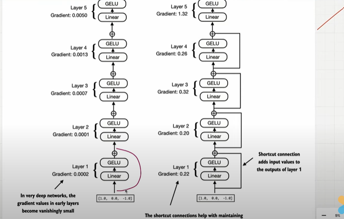
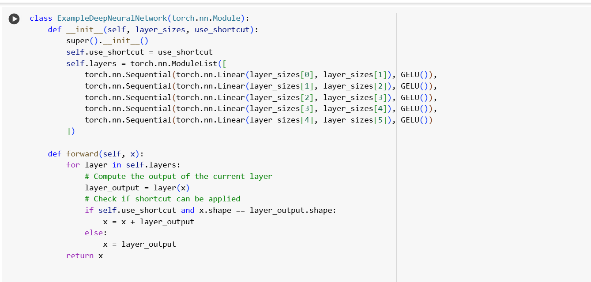
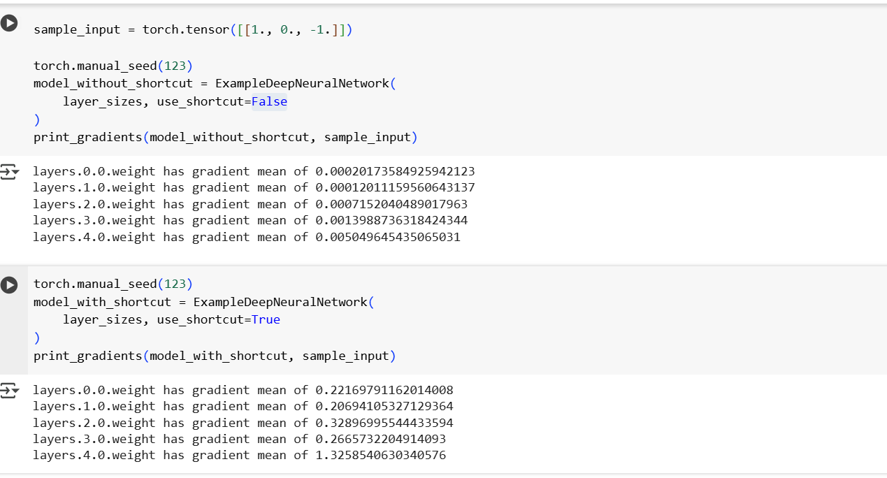

## Shortcut Connections

- Also known as skip or residual connection.
- play a crucial role in preserving flow of gradient during training backward pass.

    

- First it was introduced into computer vision to solve the gradient vanshing problem(gradient becomes smaller approaching to 0 and learning becomes slow).weight becomes not updating..
- To solve this short connection uses.

- shortcut connections create an aleranative path for the gradient to flow by skipping one or more layer.
- Adding the output of one layer to output of the latter layer.
- If you see the below images if we don't use the shortcut connection the gradient from layer 5 to layer1 it will become very small forcing to 0.
- But in the right ride if we add shortcut connection, the gradient manitaining proper weight it leads to the proper learning..

    

## Coding 

- If we didn't use shortct connection the gradient weight is so small moving to zero.
- But if we applied the shortcut connection, the gradient weight is become stable.

    

    