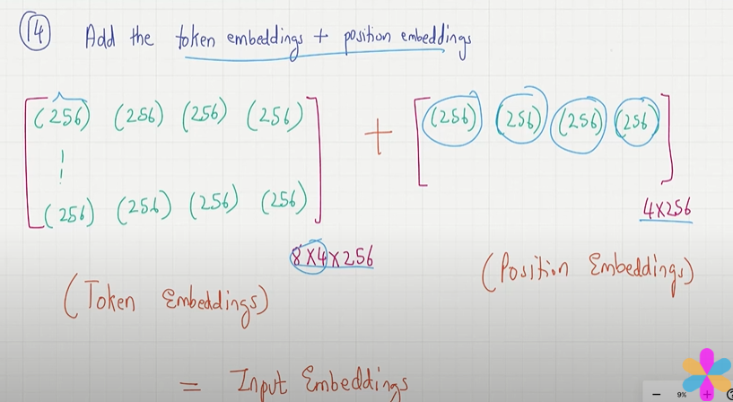

## Positional Encoding

- positional encoding is important,The cat sat on the mat (or) on the mat the cat sat..these are the two sentence.
- if we didn't mention the positional encoding the meaning of the sentence itself will change..
- very important to inject additional positional information to the LLM.

## Two Types of positional embeddings.

- **Absolute Embedding :** For each input sequence a unique embedding is added to the tokens to mentions its exact location.
- we have token embeddding for each word and now are going to add positional embeddings for each position and finally we have a input embedding,which encodes positional information.
- The positional vector and the same dimensions has origional token embedding.
- if we trained for 5 positional encoding but in the testing it came has 5 positional encoding it  don't know what to do.

    

- **Relative Embedding :** we will calculate how far the different words are.
- the model will generalize better for varying the length, even if it not seen any such thing lenght during training.

## Others 

- Both positional embedding are enable LLM to understand the order and relationship between the tokens..which helps between predictions.
- In the original paper, they used some formula to calculate the positonal encoding.

- **Absolute :** fixed order of token is crucial.Open Ai using Absolute..we need to optimize in LLM trainign..
- **Relative :** Long sequence of para..the same phrase appear in different part of sequecnce.we need to optimize .

## Absolute Coding :

- first we need to see the context length for a positional encoding and we need to add to the token embedding..
- we only need 4 positional encoding vectors.

    

- create a positional embedding layer.And values are assigning and this will optimized in the LLM Training.

    

- To create the input embeddings used in an LLM, we simply add the token and the positional embeddings

    

    