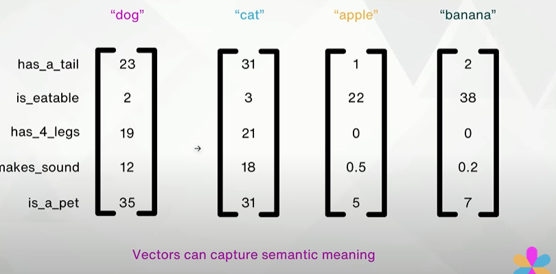
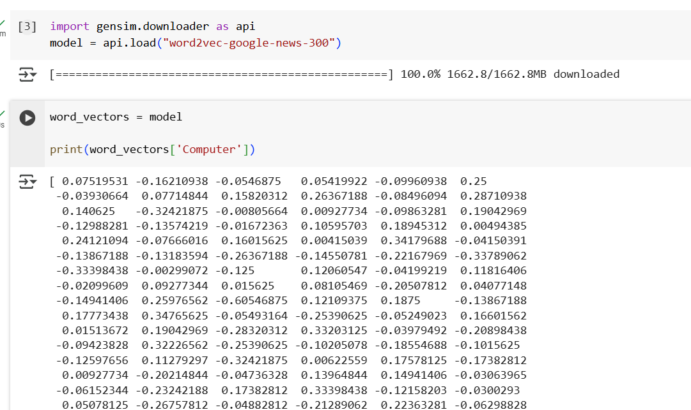
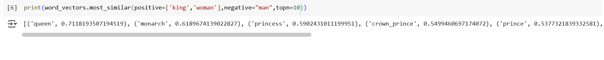
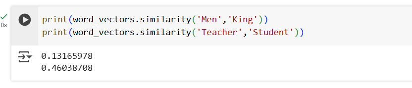
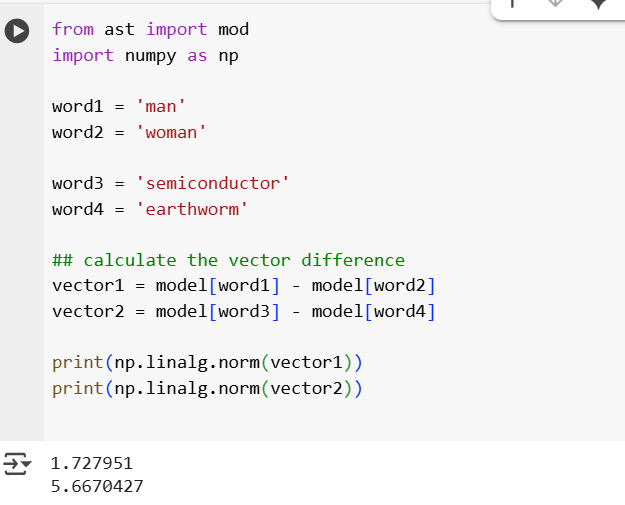
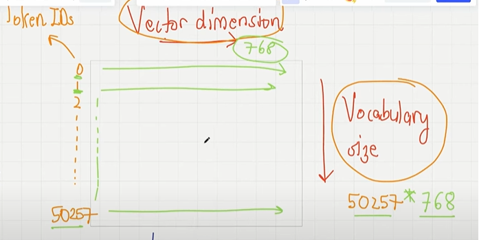
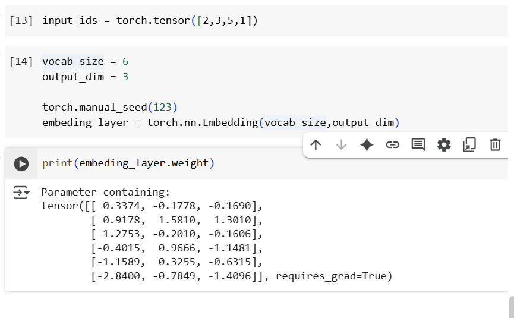
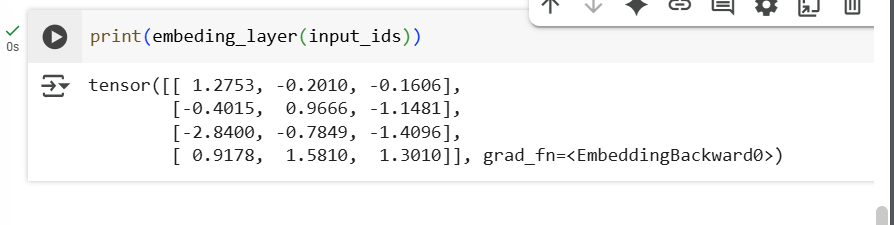
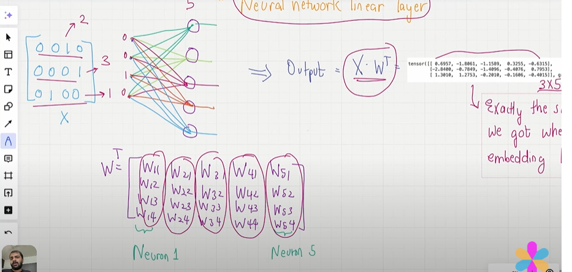

## Token Embedding

## 1. What are tokens Embedding and Why tokens embedding needed.

- Cat and Kitten are semantically related, Assigning a random number doesn't capture the relationship bt these words..
- we need to exploit the information like cat and kittens are related to each other.

- Then comes the vector.
- we can ask certain questions to the words..assign value high or low.
- If the value is high for certain question for those words..those are realteable..
- for e.g below for apple and banana is_editable value is high..so they kind of related...
- vecotrs can capture the semantic meaning, the values are close to each other..
- based on vector we can groupby the words closer to each other capture the embedding.,

## 2. How do we construct this vector embedding.

- we need to train a neural network to create a vector embedding.
- Google as already developed an vector embedding which will give the similarity of the words its called "word2vec-google-news-300".
- using this we can look at the vector embedding for a word.

    

## Most Similar in vector embedding.

- King + woman - Man 
- King related to man, woman obvisouly come as queen or princess.

    

## 4. we can check the similary of b/w few pairs..

- it will retun which pairs are closer to each other.

    

## 5. Norm Cal

- we can calculate the distance or magintude of the difference between the vectors using norm.
- How 2 words are closer each other.
- feed the data into LLM.

    

## 6. Embedding Layer weight matrix.

- For constructing embedding layer weight matrix we need to have the token Id and the vocabulary size and the vector.
- we already have the token Id but we don't know the weight.
- For to calculate the weight, intialize the embedding weights with random values.This is ths starting part of the learning..
- But this weight will be optimized as part of LLM training process.
- Each vocabulary have vector dimesnions as certain number of vector dimensions and we need to construct it.
- If you want to restrivee the vector dimensions based on the token id we can retrive.

    

- Suppose we have the following four input examples with input ids 2, 3, 5, and 1 (after tokenization).
- torch.nn.embedding will add a radom weight based on the vocab_size and dimensions..
- since the vocab size is 6 and the dimensions is 3 so we have 6 * 3.It will have 6 rows and 3 columns.
- Random values will be added for rows and columns.
- These the random weight but these are the values optimized in the LLM trainings as part of LLM.
- Basically its a lookup table, based on the token Id it will retrive that particular row vector representation.

    

- Now when you pass an input id it will look the specific rows and print out the answers.
- The embedding layer is a lookup operation that retrives rows from the embedding layer weight matric using a token Id.

    

- This is same as the neural network embedding layer but embedding layer is much more computationally efficient, since NN linear Layer has many unnecessary multiplications with Zero.

    