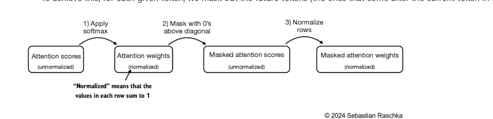
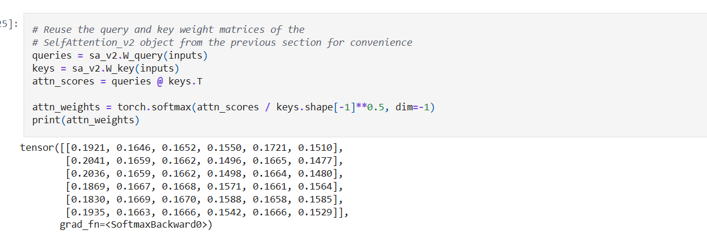
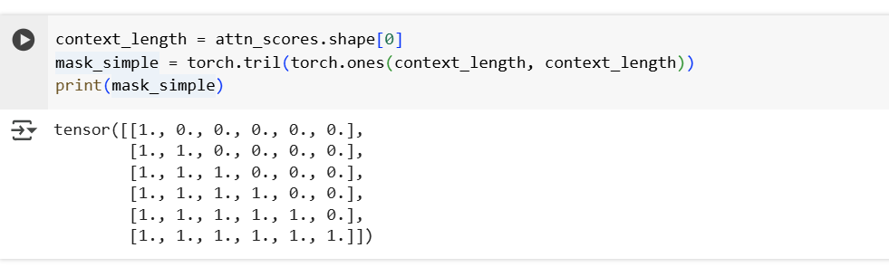
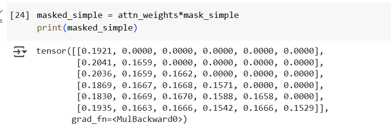
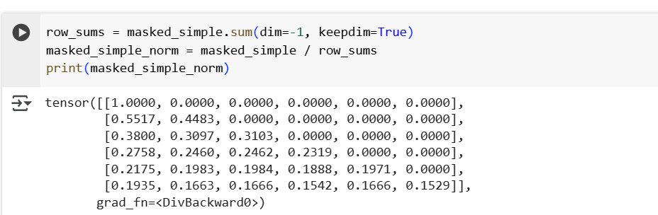
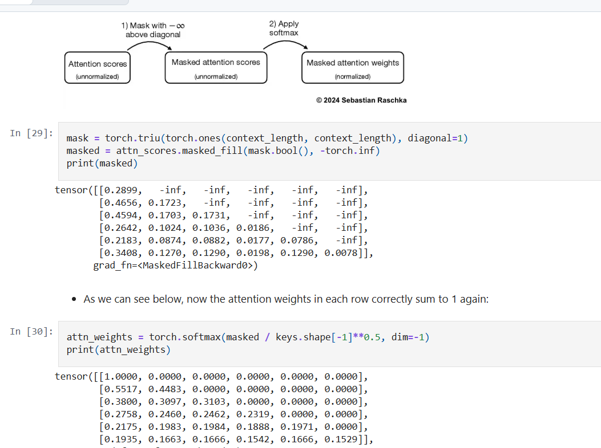
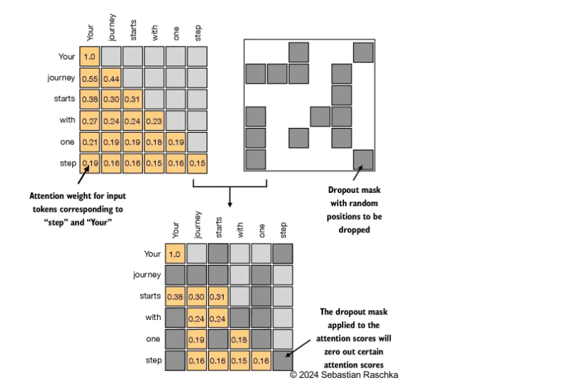
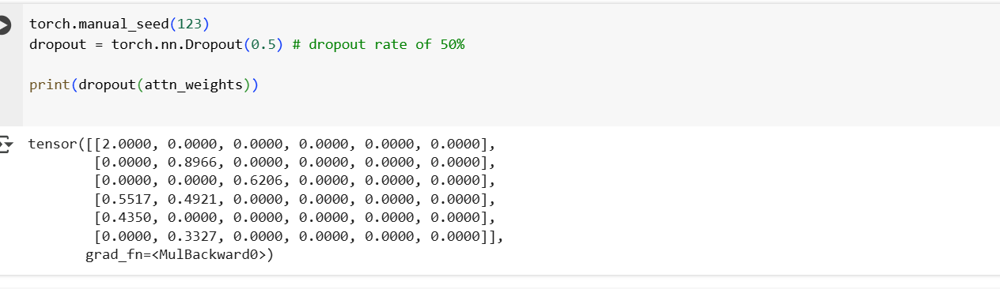

## Causal Attention

- Hiding Future words, Also called as Mask Attention.
- It restricts the model to only consider previous and current input sequence 
- Masked out future tokens for the "your" token and normalize the non masked attention such that attention weight sum upto 1 in each row..
- zero out element above the diagonal and normalizw the resulting matrix.

    

## Applying a causual Attention Mechanism
 
 - We are converting self attention mechanism into causual attention mechanism.
 - Causual attention mechanism ensures the model predict output from the previous not the future words..
 - It ensures..so the next word prediction based on the previous only
 - To achieve this we need to mask out the future words..

    

## Stage 1 : Calculate the Attention Score and Attention weights

- calculate the attention score and attention weights.

    

- The simplest way to mask out, we can use pytroch tril function to set element main daigonally above set as 0 and element below main diagonally set as 1.

    

- we can multiply the attention weights with this mask to zero out the attention scores above the diagonal

    

- However mask applied after the softmax, it will distrub the probabilty distribution created by softmax.
- softmax ensure everything sum upto 1.
- if I again use softmax it will distrub the process..it will complicate it again..
- To normalize it 1, we can use the following approach

    

- But we need to look more efficient way to achieve this.
- So, instead of zeroing out attention weights above the diagonal and renormalizing the results, we can mask the unnormalized attention scores above the diagonal with negative infinity before they enter the softmax function:

    

## Masking additional attention weights with dropout

- In addition, we use dropout to reduce the overfitting during training.
- Dropout can be applied in several places:
- for example, after computing the attention weights or after multiplying the attention weights with the value vectors
- Here, we will apply the dropout mask after computing the attention weights because it's more common
- Furthermore, in this specific example, we use a dropout rate of 50%, which means randomly masking out half of the attention weights. (When we train the GPT model later, we will use a lower dropout rate, such as 0.1 or 0.2

    

- we apply a dropout rate of 0.5 (50%), the non-dropped values will be scaled accordingly by a factor of 1/0.5 = 2
- The scaling is calculated by the formula 1 / (1 - dropout_rate)

    