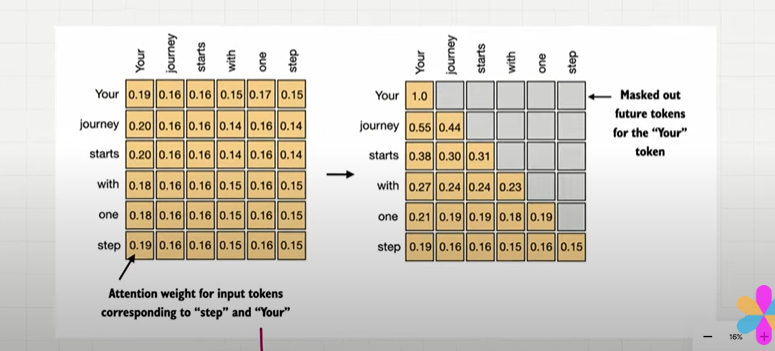

## Causal Attention

- Mask Attention.
- It restricts the model to only consider previous and current input sequence 
- Masked out future tokens for the "your" token and normalize the non masked attention such that attention weight sum upto 1 in each row..
- zero out element above the diagonal and normalizw the resulting matrix.

    

## Applying a causual Attention Mechanism