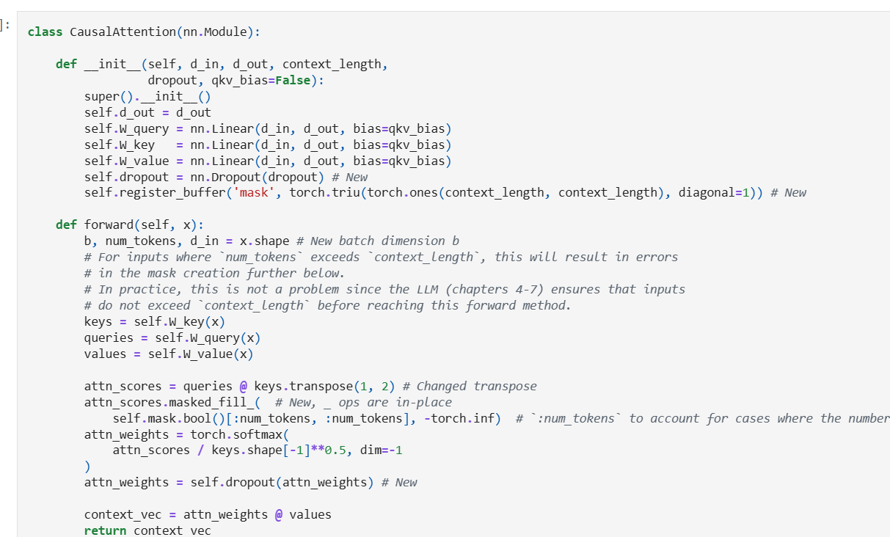

## Causal Attention

- Hiding Future words, Also called as Mask Attention.
- It restricts the model to only consider previous and current input sequence 
- Masked out future tokens for the "your" token and normalize the non masked attention such that attention weight sum upto 1 in each row..
- zero out element above the diagonal and normalizw the resulting matrix.

    

## Applying a causual Attention Mechanism
 
 - We are converting self attention mechanism into causual attention mechanism.
 - Causual attention mechanism ensures the model predict output from the previous not the future words..
 - It ensures..so the next word prediction based on the previous only
 - To achieve this we need to mask out the future words..

    

## Stage 1 : Calculate the Attention Score and Attention weights

- calculate the attention score and attention weights.

    

- The simplest way to mask out, we can use pytroch tril function to set element main daigonally above set as 0 and element below main diagonally set as 1.

    

- we can multiply the attention weights with this mask to zero out the attention scores above the diagonal

    

- However mask applied after the softmax, it will distrub the probabilty distribution created by softmax.
- softmax ensure everything sum upto 1.
- if I again use softmax it will distrub the process..it will complicate it again..
- To normalize it 1, we can use the following approach

    

- But we need to look more efficient way to achieve this.
- So, instead of zeroing out attention weights above the diagonal and renormalizing the results, we can mask the unnormalized attention scores above the diagonal with negative infinity before they enter the softmax function:
- after calculating the attention score, we can mask diagonally and we can normalize it using softmax fuction.

    

## Masking additional attention weights with dropout

- In addition, we use dropout to reduce the overfitting during training.
- Dropout can be applied in several places:
- for example, after computing the attention weights or after multiplying the attention weights with the value vectors
- Here, we will apply the dropout mask after computing the attention weights because it's more common
- Furthermore, in this specific example, we use a dropout rate of 50%, which means randomly masking out half of the attention weights. (When we train the GPT model later, we will use a lower dropout rate, such as 0.1 or 0.2

    

- we apply a dropout rate of 0.5 (50%), the non-dropped values will be scaled accordingly by a factor of 1/0.5 = 2
- The scaling is calculated by the formula 1 / (1 - dropout_rate)

    

## Self Attention with Causual Attention together

- First we have a vector dimensinal embeddings for our word..
- Now we need to calculate the query,key and value for it.To do again we can use linear to construct a random weight matrix for query,key and value.
- we can multiply the vector dimesnionss with the trianable weights each Wquery,Wkey and Wvalue to get the query,key and value.
- Now For calculating the attention score we need to multiply the query and key Transpose to get the attention score.
- Now we need mask out the future words so for that we need to mask diagonally, the diagonally above we can convert it as negative infinity.
- Now if you do normalize using softmax function, negative infinity will be considerrd as 0 and all the values will be sum upto 1.
- Now use dropout,we can dropout percentage 50%, if 50% of the neurons will be turned off..
- After that once you have attention weight..
- we can calculate context vector using attention weight and value matrix.we can multiply it and finally we got the value.
- we can process batches..

    

    