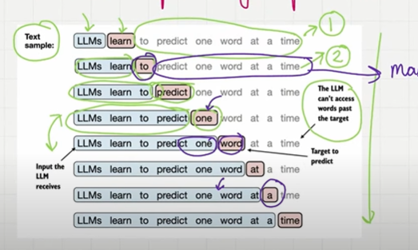
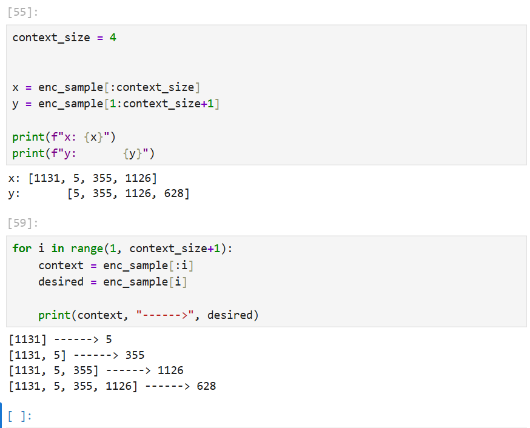
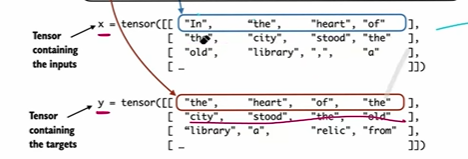
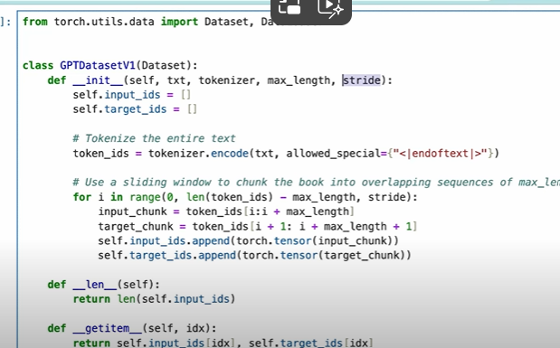
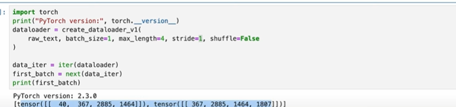

## Create Input Targets using DataLoader

- We given the input and we will predicte the next word as an ouput in the first Iteration.
- And in the second iteration, the ouput of the first word as taken as an input and it will predicts the next word.And so on it will go.

## Data Loaders

- To implement this we can collect input in tensor x and output in y tensor.
- Each row in x will be a input context and the each row in output y will be ouput context.
- tensor is a multidemionsinal array.

E.g: 5th row in x tensor is a input context and 5th row in the output y will be the output context.This is input-ouput pair.

## Construct a Dataset

- This import dataset and dataloader from the torch.
- This will accept 4 inputs, one is txt, tokenizer, max_length and stride this is like a how much input needs to be slide like 1 or 2.
- we can create 2 inputs tensor one for input_ids and target ids
- create the input and output tensor append the 2 input variables.
- get items based n the index it will return the first row of the input and the first row of the output.

## Paired the dataset with the dataloader

- Dataloader implement the ouput in structured manner.we can extract the input and output from the dataset.
- we can define stride which how many stride to the next word it is called sliding window approach.
- we can define the batchsize, if we define batch size as 8.It will take 8 rows.
- max_length is a context, context is like how many words 4 or 5.
- stride length will be equal to max length, so not over lap..

