## Simplified Self Attention Mechanism[No trainable weights]

- Let's take a word "Your Journey starts with one step".
- we get the vector dimensions of each words, but vector dimensions they are not caputuring the relationship between others.
- But we need to capture the relationship between other words for that we need to use something context vector.
- This context vector is otherwise called as enrich embedding vector basically this will have all the semantic relationship between the words or contextial information bt other words.
- Each vector have a contex vector.
- for this we need to calculate how much attention we need to give to each word.

    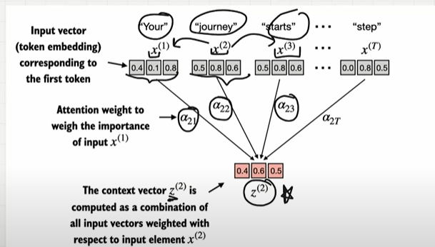

## Context Vector

- x here will be consider as input vector it will be like x1 is 1st vector embedding, x2 will be 2nd vector embedding and so on.
- z will be here defined as context vector, we need to calculate the context vector for each vector embedding.This context vector all the information about the vector and also contains information about other input elemenet like x1 and till xT.
- "your journey starts with" if this is the word, if we take "Journey" it will be considered as a query.For this query journey we need to say how much attention you need to give to the other input vectors.
- How to find the attention score, how to say your query or other input vectors relationship.
- we can use dot product, if we use this the higher the dot product,both values are aligned closed..
- if the dot product is lower, then means they are far away.
- using dot product, we can say how much vectors are aligned with each other.

## Calcualte the Attention score

- First assign a query to the second vector.
- Then create an empty tensor and now loop over the vectors you have.
- In the first iteration, get the first val in the vecor using dot product with query to find how align they are..do for rest.
- now if you find "journery, starts" are higher attention scores, so they are aligned closely with each other.
- but others are lesser attention score. so they are far away

    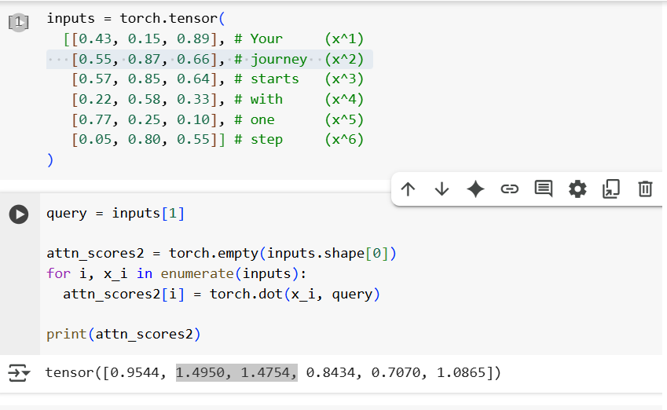

## Normalization

- Now based on the attention score i need to set a condition saying like for query a "Journey".
- For a query Journey give 40% attention to step(Input text), 30 % attention to another input word like so..
- for this sumup all the attention score divide eachby sumup value.
- This will have lot of problems like overflow or underflow for large or small input values.

    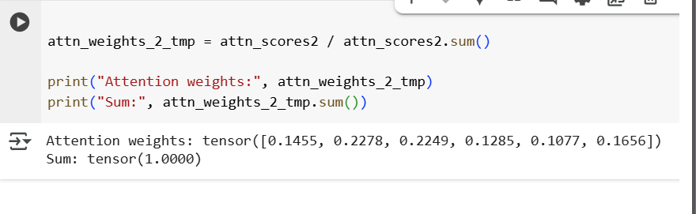

- use softmax for normalization.use pytorch for this.
- However, in practice, using the softmax function for normalization, which is better at handling extreme values and has more desirable gradient properties during training, is common and recommended.
- softmax always ensure the attentiosn weights are positive.

    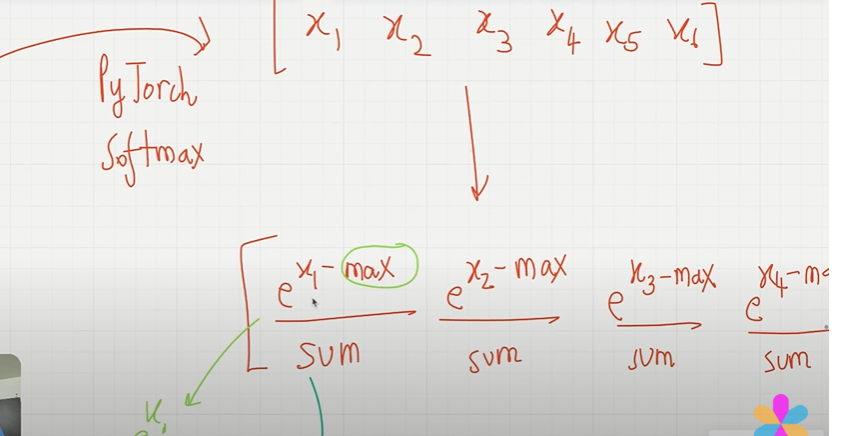
    

## Context Vector

- Now we have Input vector embedding and attention weights for each vector, simply we need to multiply it for each vector.
- once we multiplied everything sum up all to get the context vector.
- we add everything we get the context vector for journey.

    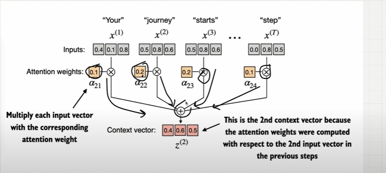
    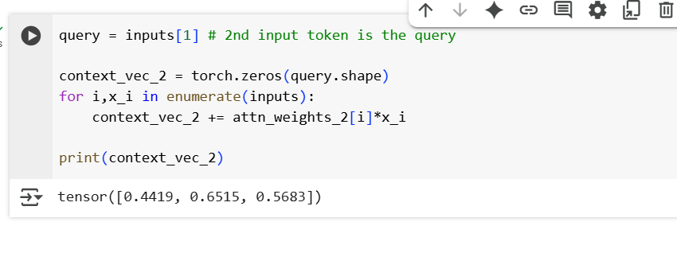

## compute attention weights for all the input token.

- we can extend similar computation as before to calculate attention weights and contenxt vector for all the inputs..
- attention weight for each  words.

    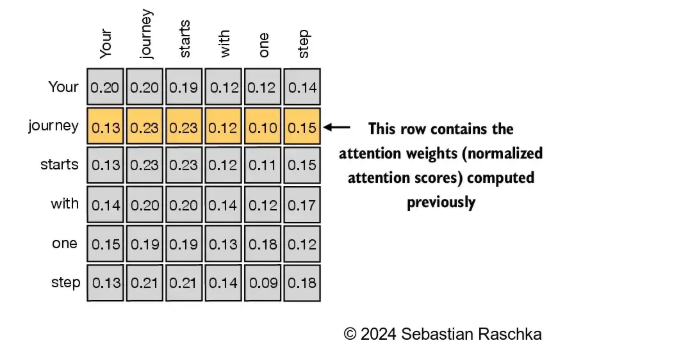

- For calculating attention score we used dot product for query and the input.
- For calculating attention weight we normalised the attention score using softmax.
- Then for context vectors, we computed weighted sum and the inputs.

## Calculate Attention score

- In the outer loop take the one and using dot product we can have dot product it to inner loop.
- the current iteration query with all the input vectors.

    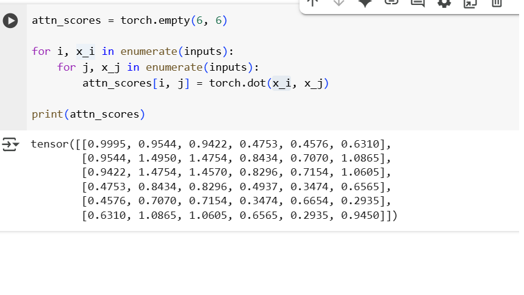

- for loops runs complex it;s slow instead use this..

    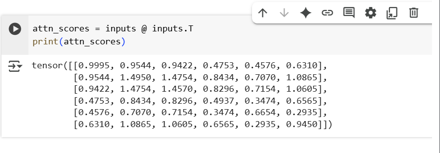

## Calculate Normalization

- dim=-1 represents softmax applied across the columns.

    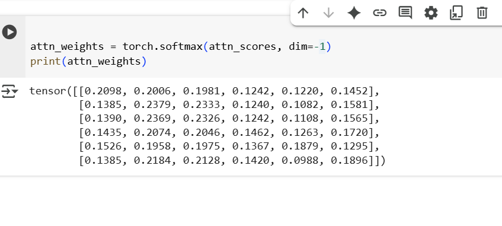

## Context vector

- r1*c1 + r2*c2 + r3*c3... 

    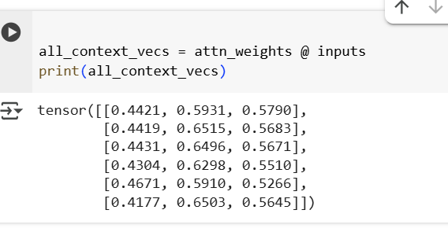

Sentece : "The cat sat on the mat because it was warm"

- without trainable weights : if we only do dot product betwen query each words embedding, we might find mat is more relateables..others have low semantically relationship..

- with trainable weights: the model should learn we need to pay attention to mat even if "mat" isn't semanticallt similar to warm.the model needs to learn that "warm" often follows "mat" in context like long range dependency..

because mat is warm.