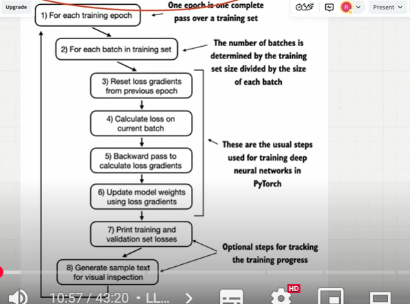
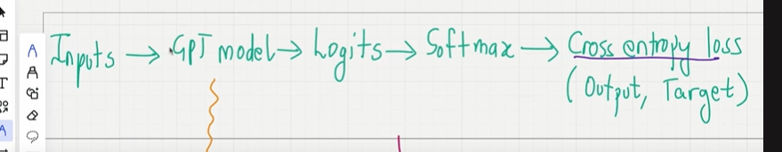
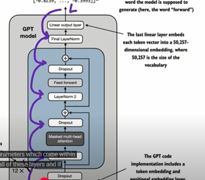
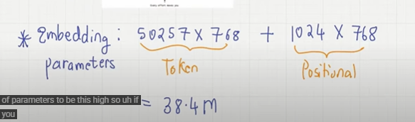
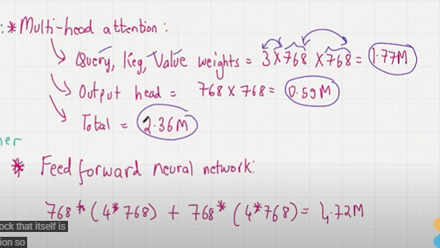
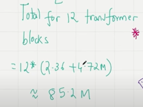
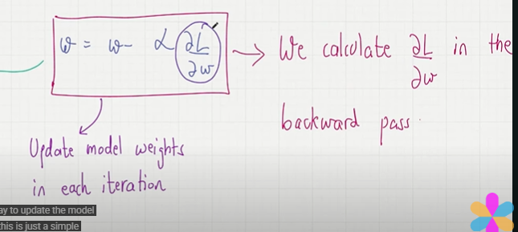

## LLM Training Function

- we are trying to minimize the loss function as small as possible..
- we want LLM output and targets are as close as possible..we use back propagation for that..

 

- first we are going to do multiple epoch..one epoch is going through the entire training set once..
- In each epoch we have multiple batches right..because the training set is divided into batches..we are going to look one batch in one loop..
-(In the first step it will be skipped) reset the loss gradient from previous epochh...
- in that batch we are going to find the loss functions.find the cross entropy for the entire batch.
- and we do backward pass to calculate the loss gradients..this will updates the model weights and parameter.
- print the training and validation lossess....
- see what's the LLM output is there...visual text represnteation...
- and we go to the next batch..
- reset the loss gradient from previous epochh...
- do the same iteration

- The goal is reach the loss function is minimumm...

- Main step : Find loss gradients..(we use loss.backward())

    

- we have loss function at the logits..we can back propagate and find the partial derivaties of the loss with the respect to all of the parameters..within all of these layers...and updating all these parameters value..till the loss is minimum...
- we optimize 161 M parameters in few mins..

    

## What makes the parameters high..

- Embedding parameters : 50257 x 768(Token Embedding) + 1024 X 768(Positional Embedding)

    

- Transformer Block : 

- Multi-head attention : query,key and value weights and output head.we have feed forward neural network is like expainson and contradiction..

    

- Total 12 transformer blcok

    

- Final Layer(softmax output): which is logits tensor..

    

- Total parameters to be optimized is if you add up it will be 162 M.
- For each parameter we need to perform gradinet descent updates..

- calculate and get the gradient is each iteraction
- update the model weights in each iteration..while doing backward pass.
- when the parameter is updating the loss function will go down....

    

## PreTraing Code : 

- First we are going to look at the training loader we are going to divide into input_batch and target batch..
- find the loss bt input and target batchh
- loss.backward() - it calculates the backward pass..calculate the gradient of the loss with respect to all the parameters.All of the 161M parameter..
- optimizer.step() - updates the parameter value based on the gradient value which are obtained..
- this loop is going through each batch in the training dataset
- when one batch is processed global step will be 1 and the global 2nd its processed global step will be 2
- we are updating the tokens..num of tokens the input batch is using...
- 1 epoch will go through the entire dataset once..

- Validation loss
- define the function called evaluate modell..get the training loss and validation loss

- aftet the first batch proces..we will evaluate the model and get the training and validation loss..
- after every 5 batches processed ..then i will show the training and the validation loss..

- after each epoch is completed..i am going to print the text
- generate_and_print_text() is going to print to print next 50 tokens LLM is predicting..

- Optimizer AdamW is a variation of Adam which uses weight decay..
- for all modern machine learning algorithm for classification, regression...adam has become the go to optmizier of choicee..it works very well..it avoids local minima..leads to faster convergence...

- number of ephocas to be 10..we are going to repear the entire processs 10 times...
- eva_frequency and eval_iteration is 5 which means afyer every 5 batches..we are going to print the training and validation loss..
- Initial text is "Every efforts moves you"