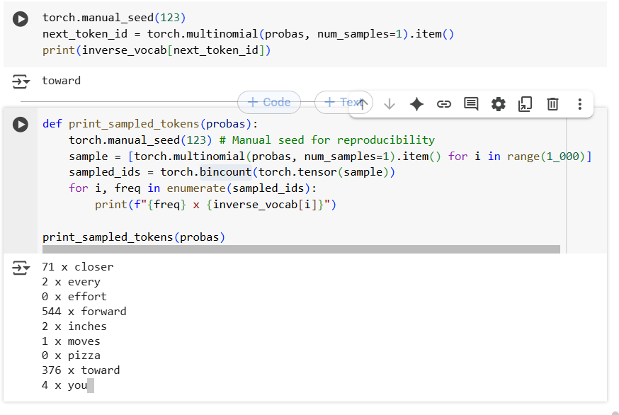
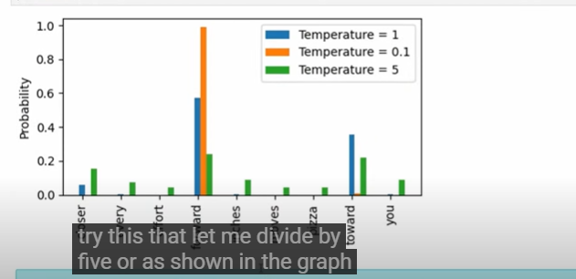

## Temperature Scaling[De-coding startigies]

- Untill now,we saw the generate token is selected corresponding to the largest probability scores among all the token in the vocabulary..
- leads to the lot of randomness and diversity in generated text
- Two techqines in the randomess one is temperate scaling and top-k sampling..both are used to reduce the overfitting..both are decoding startgies..

## Temperatre scaling

- Instead to taking the max probability at the index which corresponds to the maximum probability.
- we replace this argmax with probability distribution.
- we can use multi-nomial probability distribution so the next token is based on the probability score...
- we don't chose the token with highest probabilty we sample the next token according to the probability scores..
- we can sample the next token using the multinomial distribution..
- integration of this multinomail make sure we are not sampling the same token each item..sometimes we are going more chance to other token based on the probability score..also..more sampling..

    

- when you divide by small value the probability for one of the token will be peak.
- if the proababilt is very high..like when u divide by 5, the probabilty becomes flatter and all the tokens have values..every token will have uniform probability for becoming a next token..
- temperature value to be not too high or not too low..
good balance in the temperature..

    