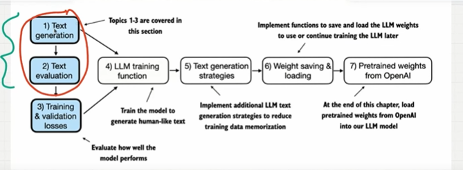
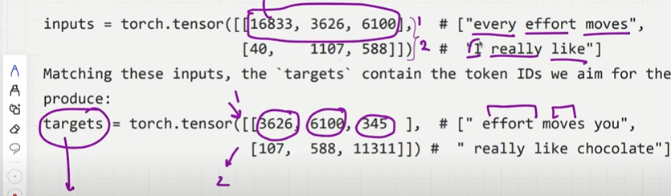
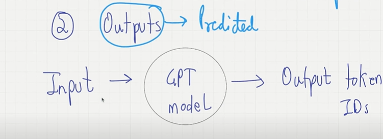
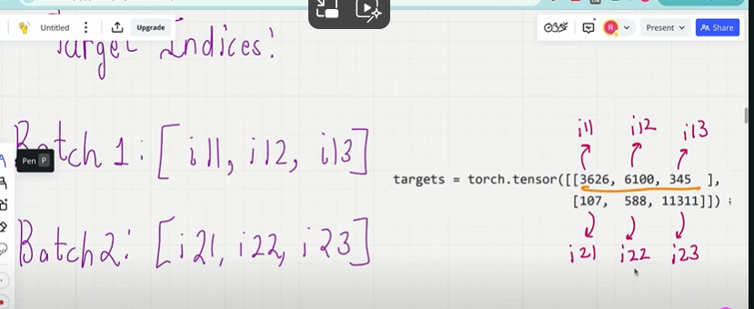
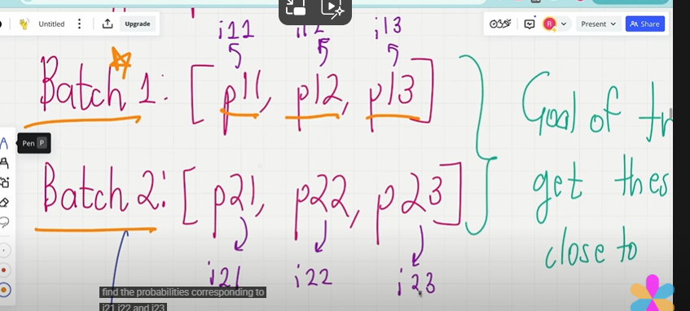
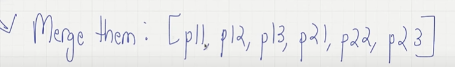
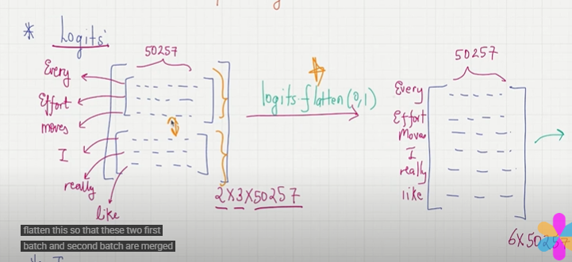
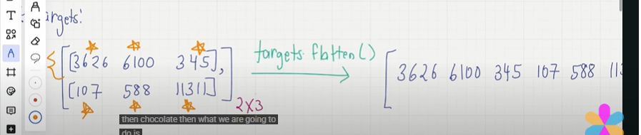
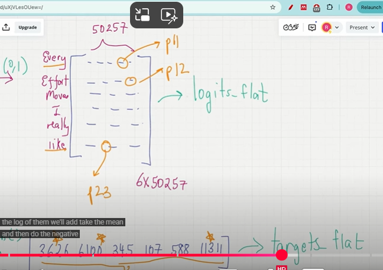
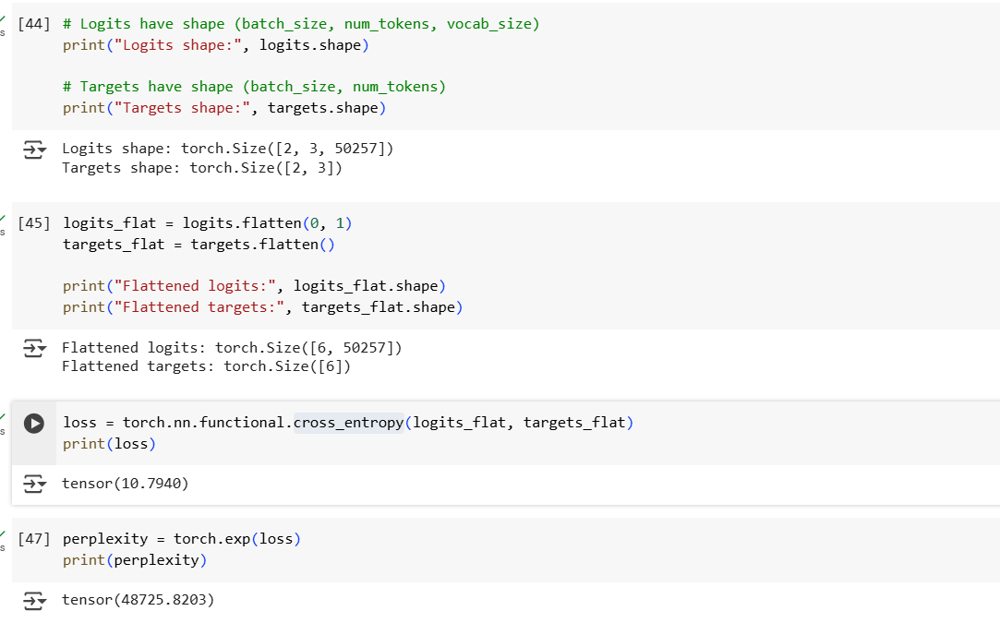

## Loss Function

- we can defines the loss functions which quantifies how good or how bad our LLM Performance.
- we can aim to minimize the losss..so that LLM can do better and better..
- once we construct the loss function it opens the door for gradient, gradient descent and backpropagation algorithmss.

    

## 1. Inputs and Targets 

-  345 is a token id corresponds to you and 11311 is a token id corresponds to chocolate.
- This target tensor is a true prediction values...

    

## 2. Outputs

- outputs are the predicited values of the LLM.
- tokenizer converts token into token ids and GPT model converts token ids into logits and logits then are converted back into tokenids..
- which are predicted values..
- tokens id we got from the output is not actual token ids because training has not happend yet..
- we want this token ids as close as the target..

    

## 3. Find the loss between the tagets & Output

- i will take the target probabilites..for each batch i will call them as i11,i12,i13,i21,i22,i23...

- i will find the probabilities corrsponding to i11, i12 and i13 in the logits..
- for batch 1 and batch 2 i will aggregate the probabilites..
- the goal of the training is to get these values close to 1 as possibile..

    

- merge these probabilites..i want all of these are close to one as possibiles..

    

- cross entropy loss..measures difference bt 2 probability distributions..

## Logits merge

- we take the logits with 2 X 3 X 50257 dimensions..
- we flatten means merge them now the dimension will be 6 X 50257.

    

## Targets merge

- we take the targets which is in multiple batches..
- flatten them merge them into one..

    

## calculate loss funtions..

- get the first val in the target compare them in first row of logits..find the index of that in the logits and assign it to p11.
- In the target get the 2nd index value and in the logits in the 2nd row check for the value..if you find the index  asssign that index as p12..
- do it for all...

    

- The cross_entropy function in PyTorch will automatically take care of applying the softmax and log-probability computation internally over those token indices in the logits that are to be maximized
- using probability we can calculate the loss bt outputs and targets..
- perplexity will tell the probability of the words to be predicted...

    

    