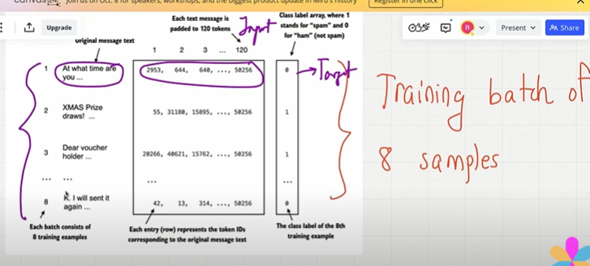
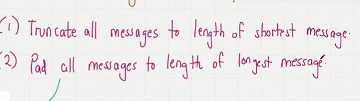
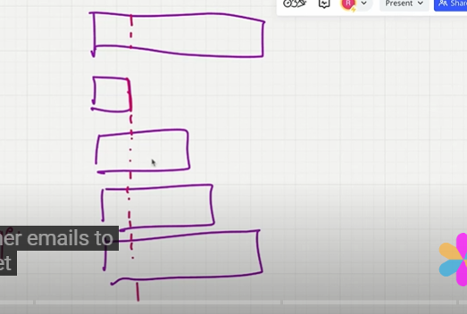
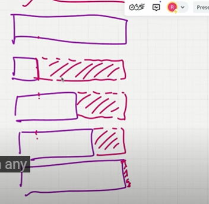
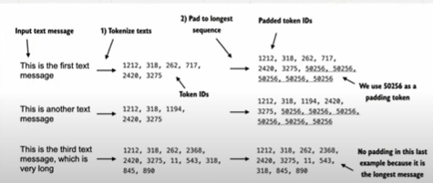

## Step 2 : DataLoader

- we need to use datasets and dataloaders..
- we need to create input and targets..

    

- Text messages are varying lenght..when we deal with batches every row has same num of columns..we need to make sure every text message has same lenght..
- two options for this one is truncate and another is pad..

    

- you take all the emails and look for the email with the shortest length and truncalte all other emails to this
- get rid of remaining length...
- one of the disadvantage is that we will lose all the remaining length information
- this is not a recommended approach..

    

- what if you use longest email..for all the other email we pad them with certain token.. we add aditional tokens..till they reach the longest emailss
- we are going to pad them with the end of text token..

    

- we use BPE to convert every text into a token ids.we can convert it token for all the text message.And the num of tokens ids won't match..
- take the longest one..for other match length of longest token id..using end of text token id..untill all the lenght of token id will be same..
    
    