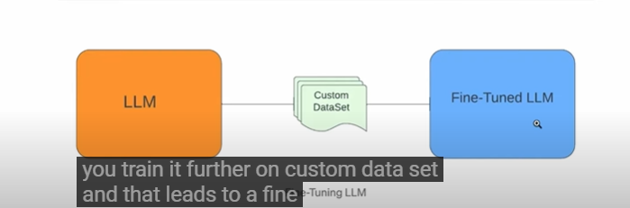
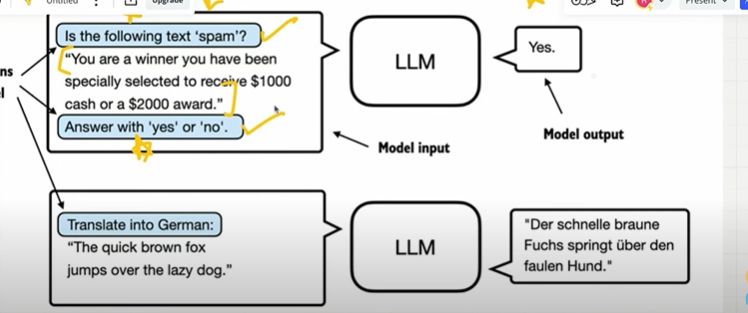
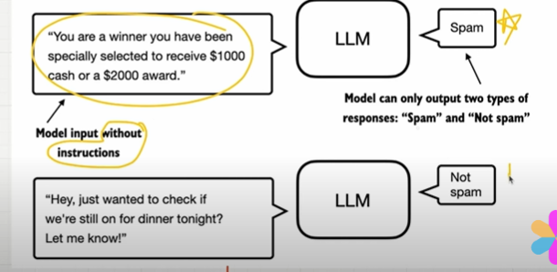
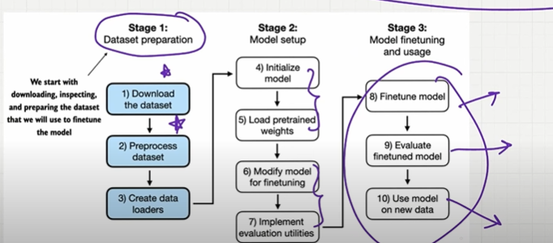

## Finetuning

- what if you have a specific task like that specific task can be constructing a chatbot based on your own data as a company..
- let say u have an educational company u want to build a chatbot based on your own data..
- pretrained is a pre-trained on general data available all over the internet..
- u need to train the model again on additional data..this called fine-tuning..
- we need to train the pre-trained LLM with domain specific datasets..

    

- Two types : Instruction Finetuning and classification finetuning

## 1. Instructions Finetuning

- Training a language on a set of task using specific instructions.
- here the instructions will be given to classification and translations..
-  it can handle broader set of tasks...
- it needs largert datasets because u want it to handle broader set of tasks..greater amount of computional power is needed
- here the instructions will be anything..anny other tasks..
- the instructions based model can handle broader set of task such as translations, summarizations

    

## 2. Classification Finetuning

- Model is trained to recoginse a specific set of class labels such as spam or no spam
- without any instructions the lLM has to classify whether it is spam or not spam
- can handle narrow set of prompts...

    

## More efficient finetuning

- parameter efficient fine tuning is efficient than any other normal finetuning...lora or qlora..
- lora instead of fine-tuning all the weightss
- qlora is memeory efficient iteration of lora..

## Classification Fine-tuning

- Fine-tuning

    

## Step 1 : download and preprocess dataset

- dataset is a SMS Spam collection huge set of emails both spam not spam..
- first we can download and unzip the dataset..
- using pandas convert it to the dataframee..so that reading becomes much more easier..
- check ham which no spam and spam 
- balance the dataset with spam and no spam both should be 747 so it is balanced...so classification will be easy,..
- we can assign ham to equal to 0 and spam to equal to 1...this is label for each of the emaill..
- we can take the dataset split into 70% training, 10% for validation and 20% for testing..once u done the the function will return traininf dataset, validation dataset and testing dataset..