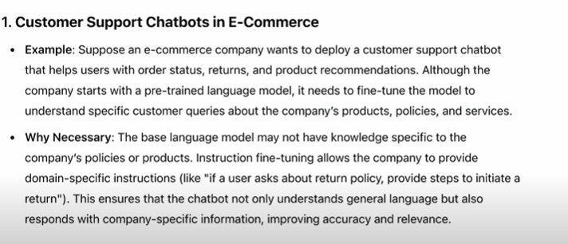

## Instruction Based Fine Tuning

- Customer specific Task, not only understand the general requirements and also for specific task.

    

- The specific set of examples
- Training on a dataset where the input-output pairs are explicitly provided..it is also called as "supervided instruction finetuning"...

    

## workflow 

- preparing the dataset, finetuning the LLM and Evaluating the LLM.

    
