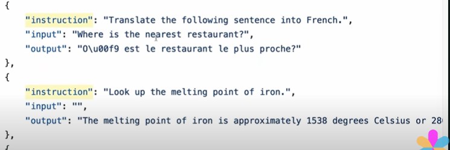
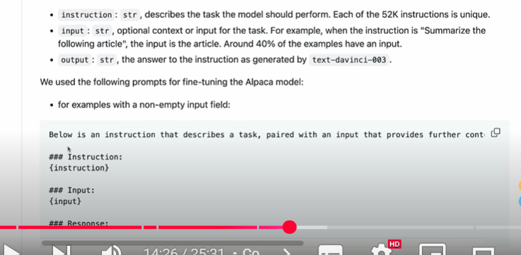
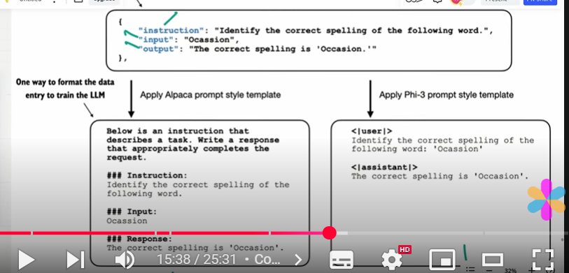
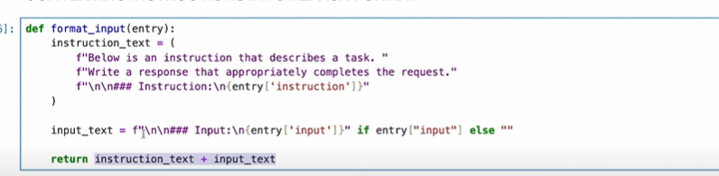
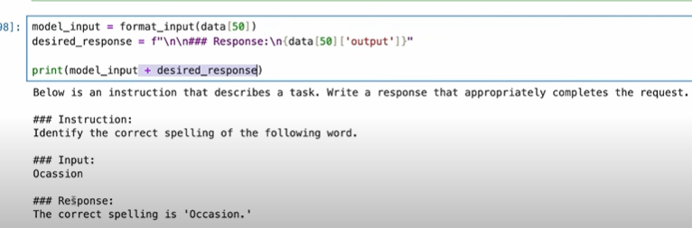
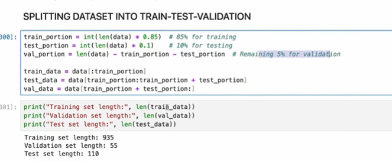

## Preparing a dataset for instruction finetuning

- How to format input-output pairs..
- dataset contains 1100 pairs of instructions..

    

## Step 1 : Download and Load

- download and load file function will go the particular URL and download the file from the URL.
- we can print the num of entries in this function..
- we can print the 50th entry and checkkk

## Step 2 : Alpaca format

- There is a specific format, we need to give to LLM
- we need to give specific format..and we need to pass instruction, input and response..

    

- Tow ways we can convert it to the specific format
- first is aplaca promot or phi-3.
- for alpaca prompt u need to prompt below the screenshot like that..then in the instruction we need to add our instructions..and input and output we can add it..
- phi-3 prompt where the it will be like user and assistant.In the user we will give instructions and input.
- And in the assitant we can give..the result..

    

- we can convert our instructions into alpaca format..
- construct the instructions and input text..if the input_text is null don't return anything..if it is there return the input..

    

- now we can take one input and we construct the response for the particular instruction and concat with your model input.

    

## Step 3 : Splitting Dataset into train-test validation

- for training data which is 85% and for testing data it will be 10% and remaining for validation which is 5%.
- split them into training and testing and validation

    

