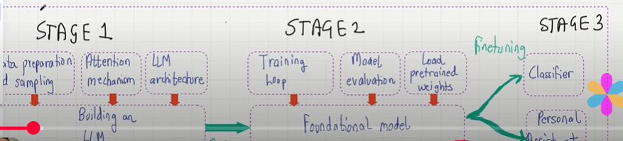
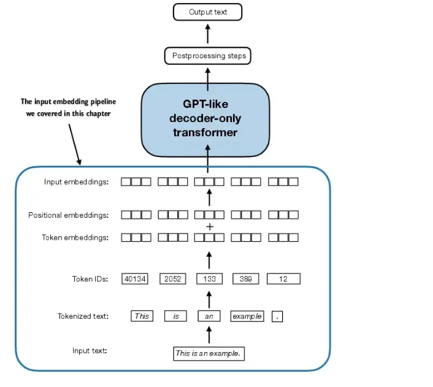

## Stages of LLM

- These are the stages of LLM
    

## Stage 1 : LLM Data Preprocessing

- Tokenization : Word Based, Character Based, Sub-words(BPE Tokenizer),
- Token Embedding : Convert token embedding to vector to find the semantic relationship..
- Positional Encoding : Encoding Information about the position of the word in the sentence
- Token Embedding + Positional Encoding = Input Encoding.

    

