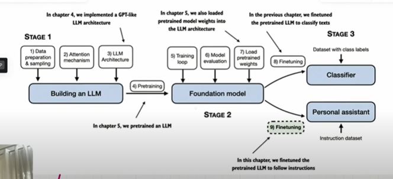
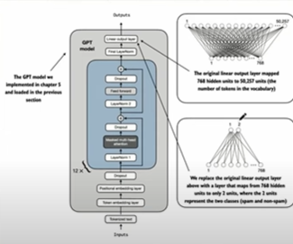

## Stages of LLM

- These are the stages of LLM
    

    

## Stage 1 : LLM Data Preprocessing

- Input 
- Tokenization : Word Based, Character Based, Sub-words(BPE Tokenizer),
- Token Embedding : Convert token embedding to vector to find the semantic relationship..
- Positional Encoding : Encoding Information about the position of the word in the sentence
- Token Embedding + Positional Encoding = Input Encoding.

    

- Attention Mechanism : we need to know how a one token is relations bt other tokens..we need a context vector..like how much inportance we need to give to other token..
- convert input vector to context vector..
- context vectors are much richer than input embedding vector..

- for do this, we need to multiply the input with key,queries and values..
- and we need to find the attention score = we can multiply key and queries..
- apply softmax and dropout
- now we have attention score then we can multiply with values the attention score with values to get context vector.this is one attention heads..

- when we consider LLM, there are multiple attention heads..to capture the long range dependecies..
- we need to combine the context vector from the multiple attention heads..we get the final context vectors..

- LLM Architecture [Transformer Block]
- Layer Normalization = apply normalization so that mean = 0 and var = 1.
- multi-head attention - 24 or 12 attn
- dropout = randomly switch off
- shortcut

- layer normal
- feed forward..
- dropout
- shortcut

- normalization
- final output layer..converts the output into logits tensor...logits helps us to predict the next word..

- 12 transformer blockksss

    
    

## Stage 2 : Foundation Mode

- calculate the loss function using cross entropy..compare the loss bt target and output values..
- Training loop - go backward pass and update the weight..do it till the loss becomes smaller..
- Model Evaluation
- Load pretrained weights from GPT-2

## Stage 3 : Finetunig - Instruction and classification Finetuning.

- Personal Assistant - instruction finetuning...
- Classifier check spam or no-spam using classification fine tuning.